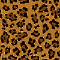

# devlog

## Mon June 17, 2024

### nlnet updates

The [first nlnet milestone PR](https://github.com/gfx-rs/wgpu/pull/5775) is really close to 
merging. I'm already working on the [follow up PR](https://github.com/gfx-rs/wgpu/pull/5824)
that adds the rest of the operators, which is milestone #2.

## Sun June 16, 2024

### nlnet updates 

After some back and for with @jimblandy on my second PR I've landed on a set of changes that 
actually produce a validating `naga::Module`! That means the system is producing viable code!

What this means is that I'm actually very close to hitting the first nlnet milestone! 

With that, I've started work on the second milestone while my first set of PRs are in review, 
as it takes a good while to roundtrip w/ feedback.

#### Spiralling out

Previously we had talked about upgrading expressions, and how there would be a "spiralling out" 
or "cascade" of upgrades needed. I think we've mostly side-stepped that requirement by first 
realizing that atomics can really only be held in global variables since they only appear in 
`workgroup` and `storage` address spaces. 

So these ops will always be accessed through a pointer to a global variable, and we can modify 
that global variable's type in place and then not worry about having to upgrade the expressions 
that contain that global variable. It's a nice simplification.

> The reason I think you won't need to update any expressions is that Naga IR Load expressions 
> and Store statements both can operate on Atomics, so everything accessing the globals whose 
> types you're whacking, whether Loads, Stores, or Atomics, should still be okay. 
>
> -- Jim Blandy

### raspberry pi updates

Still getting OOM errors and I'm not sure why. There are a few changes I need to make to figure 
it out: 

- [x] env var configurable logging in tests
  * because we need to be able to debug where the memory is going
- [x] add a new test that ensures the image comparison machinery is sane 
  * because the comparisons seem pretty borked
  * as an example, here's an image comparison:
    - expected:
      
      
    - seen:
      
      
    - mask:
      
      
    - diff:
      
      

    `seen.png` is nothing but wacky garbage!

## Fri June 14, 2024

### nlnet updates 

I put up [another incremental PR for `naga`'s SPIR-V frontend](https://github.com/gfx-rs/wgpu/pull/5775) 
that applies atomic upgrades to types and to a lesser extent to expressions. It's currently awaiting 
review from @jimblandy. If I'm still on-point and understanding the direction then I'll be adding the 
"spiraling out" of expression upgrades next. 

The "spiraling out" problem is roughly that expressions contain sub-expressions and
any expression that requires an upgrade might be referenced as a sub-expression of another,
therefore after an expression upgrade we need to traverse the `Module` looking for these 
references and upgrade the expressions that contains them - which then must be iterated upon 
again, searching the `Module` for expressions that may contain _those_ as sub-expressions.

## Sun June 9, 2024

### nlnet updates 

Following @jimblandy's advice I've got a good portion of the atomic "upgrade" process working.
* [@jimblandy's explaination of steps required](https://app.element.io/#/room/#naga:matrix.org/$eIqQA71wsmmzR0NWug4KsSFk3YKiX8zpIG6ToNN-0Sk)

## Tue June 4, 2024

### nlnet updates 

I'm working on "upgrading" pointer types in `naga`'s SPIR-V frontend. This really is the meat of the 
problem, I would say. I'm attempting to follow this process, roughly:

- in the frontend:
  * lookup the pointer's expression
  * lookup the type of that expression
  * get the id of the base type of that type (because the type is essentially `Pointer<T>` 
    and we want the `T`)
  * lookup up the base type
- then in the `Module`: 
  * get that same base type in the types arena
  * replace that type with an atomic type

This works fine, so long as no other types are using that base type. Odds are that the base type is 
`u32` or `i32`, though, and that it _is_ indeed being used elsewhere, which fails to type check. 
This is expected because we're changing the type for everything that references it.

So, instead we can try it this way - it's all the same up to interacting with the module: 

  - then in the `Module`: 
    * create a new atomic type with the base type of the type we were going to replace
    * get the pointer type from the types arena
    * replace the pointer's base type with the atomic type

This gives us a different error:    

```
WithSpan { inner: InvalidHandle(ForwardDependency(FwdDepError { subject: [3], subject_kind: "naga::Type", depends_on: [6], depends_on_kind: "naga::Type" })), spans: [] }
```

which essentially means that type `[3]` depends on type `[6]` but obviously `3` < `6`, and this is a 
problem because the handles of the types imply when they were declared. So it's saying that `[3]` 
_cannot_ depend on `[6]` because when declaring `[3]` all symbols used in that declaration must also 
have been previously declared, and `[6]` is greater than `[3]` and therefore was not pre-declared.

So here we are. I've had a couple ideas, and none of them are great: 

1. Modify all handles in the module and the frontend, incrementing all handles >= the pointer's handle,
   then inserting the atomic type using the pointers handle.
   This is error prone because I'm not sure where all the handles are, where they get copied, etc.
   But maybe I'm overestimating this solution.
2. Change `Handle`'s type to include some extra bit of information to allow the comparison to check.
   This is bad for obvious reasons - `Handle` is small on purpose and something like this would probably
   blow out the performance characteristics. Also there are probably *many* handles being created and 
   there may be memory concerns.
3. Do something else like provision some handles up front to use later. Possibly any time a pointer is 
   created, also create another placeholder handle.

I posted this on the `wgpu`/`naga` matrix and @jimblandy [replied here](https://app.element.io/#/room/#naga:matrix.org/$QkIQkuLk6yxqEXAt3uArnZpvV9C8pDhGJni5800QVv4).

## Mon June 3, 2024

### nlnet updates 

[My first PR to add atomics to naga's SPIR-V frontend](https://github.com/gfx-rs/wgpu/pull/5702) was 
merged last week! I'm super stoked because I was worried it might be a bit beyond my pay grade, but 
I figured it out with the help of @jimblandy.

### Atlas improvements

Finally, the atlas in renderling is a true texture array, greatly increasing `renderling`'s texture
capacity.

By default the atlas holds an array of 2048x2048x8 textures, but it's configurable so if you need 
more you can bump up the default size in `Context`, before you create the stage.

### renderling-ui

I've rebuilt and released a good portion of [`renderling-ui`](https://crates.io/renderling-ui). 
Partially because @jimsynz wanted to use `renderling` as a [`scenic`](hexdocs.pm/scenic/) driver,
and partially because I still want to be able to write game and tools UI with `renderling`.

## Sat May 25, 2024

### SPIR-V atomics update

[My first PR to add atomics to naga's SPIR-V frontend](https://github.com/gfx-rs/wgpu/pull/5702) is 
just about ready. Most of the work has been about figuring out how to use the `naga` machinery.

Here's a step-by-step of the strategy for adding support for _parsing_ a new atomic operation: 

- Add a match for the op in the `terminator` loop of `naga::front::spv::Frontend::next_block`.
  [Like so](https://github.com/gfx-rs/wgpu/pull/5702/files#diff-da9de19bca31f63903511682e750d4a03d5ffaae563f0a95d23b3f6d41bc0391R3963).
  This matches whenever the parser encounters your op.
- Ensure the current instruction is the correct size.
  [Here](https://github.com/gfx-rs/wgpu/pull/5702/files#diff-da9de19bca31f63903511682e750d4a03d5ffaae563f0a95d23b3f6d41bc0391R3964).
  Essentially, `inst.expect({size})?;`, where `size` can be found from the SPIR-V spec, which in this case is
  <https://registry.khronos.org/SPIR-V/specs/unified1/SPIRV.html#OpAtomicIIncrement>.

  The first value in the table is the "Word Count" of the instruction. From the spec:

  > Word Count is the high-order 16 bits of word 0 of the instruction, holding its total WordCount. 
  > If the instruction takes a variable number of operands, Word Count also says "+ variable", 
  > after stating the minimum size of the instruction.

  You can find the lowdown on the form of each instruction 
  [here](https://registry.khronos.org/SPIR-V/specs/unified1/SPIRV.html#_instructions_3).

- Then we store the op for a later pass (to be implemented later) when we'll upgrade the associated 
  types:
  [Here](https://github.com/gfx-rs/wgpu/pull/5702/files#diff-da9de19bca31f63903511682e750d4a03d5ffaae563f0a95d23b3f6d41bc0391R3972-R3981).

- Lastly we have the real meat of the problem where we construct the types and variables in the `naga` module.
  [Shown here](https://github.com/gfx-rs/wgpu/pull/5702/files#diff-da9de19bca31f63903511682e750d4a03d5ffaae563f0a95d23b3f6d41bc0391R3985-R4036).
  This step will be different for each op and depends on the inputs and outpus of that op. 

At this point the op can be parsed and WGSL (or whatever the output language) can be emitted, 
but the module **will fail to validate**. This is expected because the types used in the atomic op 
have not yet been upgraded to their atomic counterparts, which is the crux of the problem and also the 
subject of the next PR. 

## Tue May 21, 2024 

### Crabslab updates

I replaced the slab indexing in `crabslab` with `spirv_std::IndexUnchecked` when the `target_arch` 
is `"spirv"`. This had the effect of DRASTICALLY reducing the nesting in the resulting WGSL code, 
and also GREATLY reducing the size of that code. Here are some percentage changes in the SPIR-V
shader files produced by `rust-gpu`:

```
- 7.55%: bloom-bloom_downsample_fragment.spv
-10.00%: bloom-bloom_mix_fragment.spv
-10.81%: bloom-bloom_upsample_fragment.spv
  0.00%: bloom-bloom_vertex.spv
  0.00%: convolution-brdf_lut_convolution_fragment.spv
  0.00%: convolution-brdf_lut_convolution_vertex.spv
  0.00%: convolution-generate_mipmap_fragment.spv
  0.00%: convolution-generate_mipmap_vertex.spv
  0.00%: convolution-prefilter_environment_cubemap_fragment.spv
-36.00%: convolution-prefilter_environment_cubemap_vertex.spv
  0.00%: skybox-skybox_cubemap_fragment.spv
-33.08%: skybox-skybox_cubemap_vertex.spv
  0.00%: skybox-skybox_equirectangular_fragment.spv
-40.00%: skybox-skybox_vertex.spv
-25.27%: stage-renderlet_fragment.spv
-30.77%: stage-renderlet_vertex.spv
- 6.78%: tonemapping-tonemapping_fragment.spv
  0.00%: tonemapping-tonemapping_vertex.spv
  0.00%: tutorial-tutorial_implicit_isosceles_vertex.spv
  0.00%: tutorial-tutorial_passthru_fragment.spv
-39.29%: tutorial-tutorial_slabbed_renderlet.spv
-37.76%: tutorial-tutorial_slabbed_vertices.spv
-37.50%: tutorial-tutorial_slabbed_vertices_no_instance.spv
```

Drastically reducing the nesting in resulting WGSL code means that `naga` shouldn't err when 
translating the SPIR-V code into WGSL on web. This means that `renderling` works on web again!

Greatly reducing the size of the SPIR-V files may eliminate the stack overflow on Windows.

## Tue May 14, 2024

### Website! 

Part of the NLnet work is setting up a website to host this devlog, docs, guides etc. 
So yesterday I bought a domain - [renderling.xyz](https://renderling.xyz)!
I figured since renderling is a 3d renderer `.xyz` was a good choice. It was either that
or `.rs`, but I do my domains through AWS Route53 which doesn't support `.rs` as a TLD.
Also I hope that this library gets used by a wider audience than just the Rust community.
I have plans to write bindings at some point, afterall.

### `naga` SPIR-V atomics support

I opened my first PR into `wgpu` [to add support for atomics in the SPIR-V frontend](https://github.com/gfx-rs/wgpu/pull/5702).
This is the first of many PRs and this is the main focus of the NLnet work.
The PR itself is more of a sanity check that I'm "doing things right". I figured I'd 
open it early since I'm unfamiliar with the way `naga` does things.

## Sun May 12, 2024 

### More Fox Skinning

I've noticed that some GLTF models (like `CesiumMan`) cause the uber-shader to barf. 
I haven't figured out what feature in those models is causing it yet. It may or may not 
be related to the fox skinning problem.

### Box!

A very simple GLTF file fails to render. It's the `Box.glb` model. 


Ooh, now upon visiting the [Khronos sample models repo](https://github.com/KhronosGroup/glTF-Sample-Models?tab=readme-ov-file)
I find that it (the repo) has been deprecated in favor of [another](https://github.com/KhronosGroup/glTF-Sample-Assets).

Anyway - this is a fundamentally simple GLTF model so something must have regressed in `renderling`...

#### Investigation

* Turns out there are buffer writes happening each frame, which is weird because the `Box.glb` model doesn't 
  include animation.
* When I trace it out it looks like the camera's view has NaN values.
* Looks like after adding a `debug_assert!` I can see that the camera's calculated radius (the 
  distance at which the camera rotates around the model) is `inf`...
* That's because after loading, the model's bounding box is `[inf, inf, inf] [-inf, -inf, -inf]`...
* And calculation of the bounding box only takes into consideration the nodes in the scene and 
  doesn't include those node's children...

After updating the bounding box calculation to take child nodes into consideration the problem 
is fixed.


* But there are still two `Transform` writes per frame when there should be none.
* I can't see any other place in the example app where those transforms are being updated.
* I recently redid the way `NestedTransform` do their updates, so I'll look there.
* There's nothing modifying those transforms...
* Ah, but each update source is being polled for updates each frame, and NestedTransforms 
  always give their global transform as an update regardless if it changed.
* I'm changing the update sources to be a set, and the `SlabAllocator` only checks those sources
  that have sent in an "update" signal on its notification channel. This also means we only check 
  sources for strong counts when this "update" signal comes in, so those sources need to send the 
  signal on Drop. All in all though this should be a nice optimization.
* ...but alas, after the update I get the grey screen of death again, which means something's not 
  right...
* Turns out it was because `Gpu::new` was calling `SlabAllocator::next_update_k` twice, using one 
  for its `notifier_index` and then using the other for the first notification.

## Sat May 11, 2024

### Skinning a Fox


Skinning is pretty hard! I remember before that it took a good amount of fiddling before 
vertex skinning "clicked". I understand the concept and how it should work, but in practice 
I feel like there's always a matrix multiplication that is in the wrong order, or that I'm 
missing (I've been through it twice now).

It's weird because the "simple skin" example runs as expected. For the most part the "recursive skins"
example does too (it's slow though because it's a stress test). So there's something special about the 
fox that is tripping the renderer...

```
cargo watch -x 'run -p example -- --model /Users/schell/code/glTF-Sample-Models/2.0/RecursiveSkeletons/glTF-Binary/RecursiveSkeletons.glb  --skybox /Users/schell/code/renderling/img/hdr/resting_place.hdr'
```

### Sidetracked by performance

I saw that the recursive skeleton example wasn't doing so well, it was really slow. After a little 
investigation I saw that it was making something like 40,000 separate buffer writes per frame.

So I rewrote the "updates" code that syncs CPU -> GPU values and now it does 900 buffer writes per frame.
That still seems high, but given that it has something like 800 animated nodes I don't think it's a big 
deal. It runs smooth now!

But I still haven't figured out that fox...

## Wed May 9, 2024

I finished the Memorandum of Understanding for my NLnet grant. 
The MoU is kinda like a project plan or roadmap that lets NLnet know what the milestones are 
and when I'll be requesting payment. It's nice to have this amount of organization - even if 
there is a bit of overhead for it. I like knowing the steps the library is going to move through.

### Animation 

I'm having trouble debugging the fox's animation. 

It could be:
* hierarchical node transforms are not recalculating as expected
* node hierarchy could be wrong in some way

Let's step through one animation frame: 

```
progressing 'Survey' 0.001417125 seconds
  total: 3.4166667
  current: 0.21563251
  21 properties
    8 rotation
    7 rotation
    11 rotation
    10 rotation
    9 rotation
    14 rotation
    13 rotation
    12 rotation
    6 rotation
    5 rotation
    17 rotation
    16 rotation
    15 rotation
    20 rotation
    19 rotation
    18 rotation
    24 rotation
    23 rotation
    22 rotation
    4 translation
    4 rotation
```

And here's the log output while building the GLTF model:

```
drawing GLTF node 0 Some("root")
  node has no mesh
  has 1 children: [2]
drawing GLTF node 2 Some("_rootJoint")
  node has no mesh
  has 1 children: [3]
drawing GLTF node 3 Some("b_Root_00")
  node has no mesh
  has 1 children: [4]
drawing GLTF node 4 Some("b_Hip_01")
  node has no mesh
  has 4 children: [5, 15, 18, 22]
drawing GLTF node 5 Some("b_Spine01_02")
  node has no mesh
  has 1 children: [6]
drawing GLTF node 6 Some("b_Spine02_03")
  node has no mesh
  has 3 children: [7, 9, 12]
drawing GLTF node 7 Some("b_Neck_04")
  node has no mesh
  has 1 children: [8]
drawing GLTF node 8 Some("b_Head_05")
  node has no mesh
  has 0 children: []
drawing GLTF node 9 Some("b_RightUpperArm_06")
  node has no mesh
  has 1 children: [10]
drawing GLTF node 10 Some("b_RightForeArm_07")
  node has no mesh
  has 1 children: [11]
drawing GLTF node 11 Some("b_RightHand_08")
  node has no mesh
  has 0 children: []
drawing GLTF node 12 Some("b_LeftUpperArm_09")
  node has no mesh
  has 1 children: [13]
drawing GLTF node 13 Some("b_LeftForeArm_010")
  node has no mesh
  has 1 children: [14]
drawing GLTF node 14 Some("b_LeftHand_011")
  node has no mesh
  has 0 children: []
drawing GLTF node 15 Some("b_Tail01_012")
  node has no mesh
  has 1 children: [16]
drawing GLTF node 16 Some("b_Tail02_013")
  node has no mesh
  has 1 children: [17]
drawing GLTF node 17 Some("b_Tail03_014")
  node has no mesh
  has 0 children: []
drawing GLTF node 18 Some("b_LeftLeg01_015")
  node has no mesh
  has 1 children: [19]
drawing GLTF node 19 Some("b_LeftLeg02_016")
  node has no mesh
  has 1 children: [20]
drawing GLTF node 20 Some("b_LeftFoot01_017")
  node has no mesh
  has 1 children: [21]
drawing GLTF node 21 Some("b_LeftFoot02_018")
  node has no mesh
  has 0 children: []
drawing GLTF node 22 Some("b_RightLeg01_019")
  node has no mesh
  has 1 children: [23]
drawing GLTF node 23 Some("b_RightLeg02_020")
  node has no mesh
  has 1 children: [24]
drawing GLTF node 24 Some("b_RightFoot01_021")
  node has no mesh
  has 1 children: [25]
drawing GLTF node 25 Some("b_RightFoot02_022")
  node has no mesh
  has 0 children: []
drawing GLTF node 1 Some("fox")
  mesh 0
    has 1 primitives
    created renderlet 1/1: Renderlet {
        visible: true,
        vertices_array: Array<renderling::stage::Vertex>(370, 1728),
        indices_array: Array<u32>(null),
        camera_id: Id<renderling::camera::Camera>(24),
        transform_id: Id<renderling::transform::Transform>(309),
        material_id: Id<renderling::pbr::Material>(348),
        pbr_config_id: Id<renderling::pbr::PbrConfig>(0),
        debug_index: 0,
    }
  has 0 children: []
```

### NAN in shaders for no apparent reason

While re-building vertex skinning I've run into an odd problem where `naga` says my SPIR-V has 
`NaN` values in it, which are invalid. I'm trying to track down where these values are getting 
introduced. It's somewhere in `glam`, I'm pretty sure. 

To aid in doing this I'm taking advantage of the `validate_shaders` test and `cargo watch`. 

My setup is like this: 

* in my code I've created a minimal vertex shader to work on in isolation:
  ```rust
  #[spirv(vertex)]
  pub fn nan_catcher(
      #[spirv(vertex_index)] vertex_index: u32,
      #[spirv(storage_buffer, descriptor_set = 0, binding = 0)] slab: &[u32],
      #[spirv(position)] clip_pos: &mut Vec4,
  ) {
      let skin = Skin::default();
      let t = skin.get_transform(Vertex::default(), slab);
      *clip_pos = Mat4::from(t) * UNIT_QUAD_CCW[vertex_index as usize % 6].extend(1.0);
  } 
  ```

* In one terminal tab we auto-compile our shaders: 

  ```
    cd shaders
    cargo watch --ignore ../crates/renderling/src/linkage/ --watch ../crates/renderling/src/stage --watch ../crates/renderling/src/stage.rs -x 'run --release -- --no-default-features'
  ```

  `--no-default-features` turns _off_ all the other shaders, so only this "nan-catcher" is compiled.
  `--ignore ../crates/renderling/src/linkage/` is important because another terminal tab is creating a WGSL file in that directory

* in another terminal tab we watch for changes to the compiled shaders and then run validation: 

  ```
  only_shader=stage-nan_catcher print_wgsl=1 cargo watch --ignore stage-nan_catcher.wgsl --watch crates/renderling/src/linkage/ -x 'test -p renderling -- --nocapture validate_shaders'  
  ```

  `only_shader` validates only my "nan-catcher" shader and `print_wgsl` saves the source 
  (regardless of validation)

All together this lets me know if my shader validates after each change.

#### Solution 

As it turns out `Transform`'s `From<Mat4>` was the culprit. It was using `Mat4::to_scale_rotation_translation`, 
which calls `f32::signum`, which uses `NAN`. 

The crappy part is that `clippy` would have caught it, because both of those functions are listed in `disallowed-methods`,
but I hardly ever _run_ clippy. So now I've got to make that a normal practice.

## Wed May 8, 2024

TODO: `crabslab` probably doesn't need to generate the `offset_of_*` functions. It's a bit noisy, 
and not as useful as I planned.

Also, the `WgpuBuffer` in `crabslab` probably shouldn't be part of the library. I've already 
stopped using it in `renderling`.

### Animator

I've added `renderling::stage::Animator` to help with animating GLTF nodes.

## Tue May 7, 2024

I had the intake meeting with NLnet's Lwenn and Gerben and they were very sweet people. 
Everything went well and I should be able to get to work on naga's atomics this week!

The following is some of the stuff I managed to fit into renderling these past two weeks.

### Physically based bloom!

I re-built the bloom effect to the updated "PBR" technique that downsamples an HDR texture
and then upsamples the mips and mixes it in. It looks quite nice. The `Bloom` object can 
also be used without the rest of renderling, though it depends on renderling's texture type.
I feel like the library is small enough in total that if somebody wants just the bloom it 
would be worth it.

### Refactor

I did quite a lot of API refactoring to make the library more predictable. 

### Slab allocator 
I also added a proper slab-ish arena-ish allocator that does automatic-ish syncronozation. 
With the new `SlabAllocator` (and `Stage`, for that matter) one can create "hybrid" values 
that live on both the CPU and GPU. Those values can be "downgraded" to GPU-only values to 
release CPU memory. Symmetrically those GPU-only values can also be "upgraded" to "hybrid"
values later. 

All in all  I feel like the API is really feeling quite polished!

## New work in the short-term
### Animation 

I'm going to re-build GLTF animation before getting to work on atomics, since that feature 
is not blocked by atomics.

### Atomics

I'm kicking off work on adding atomics to `naga`'s SPIR-V frontend. These are all the 
operations in the SPIR-V spec (at least at my first glance):

* OpAtomicLoad
* OpAtomicStore
* OpAtomicExchange
* OpAtomicCompareExchange
* OpAtomicCompareExchangeWeak
* OpAtomicIIncrement
* OpAtomicIDecrement
* OpAtomicIAdd
* OpAtomicISub
* OpAtomicSMin
* OpAtomicUMin
* OpAtomicSMax
* OpAtomicUMax
* OpAtomicAnd
* OpAtomicOr
* OpAtomicXor
* OpAtomicFlagTestAndSet
* OpAtomicFlagClear

...and then it looks like there are some extension ops: 

* OpAtomicFMinEXT
* OpAtomicFMaxEXT
* OpAtomicFAddEXT

But the extensions seem to be reserved and don't have descriptions, so maybe they're not 
used yet?


## Thu Apr 25, 2024 

I missed the intro meeting for NLnet grantees :(. 
I realized that I'm just no good at timezones. I'm so used to talking with folks in 
LA and SF (and I'm in NZ) that I just assumed our meeting would cross the international 
date line, and I got the date wrong! The NLnet folks assured me that it's ok, 
but I was really looking forward to meeting the other project developers.

Anyway - I've been putting together the development plan and the software bill of materials 
as part of the intake process for the NLnet grant. It's a lot of crossing `T`s and dotting ...
lower case `J`s, but the project will be so much better organized for it.

## Wed Apr 24, 2024 🎉

NLnet is officially sponsoring the development of `renderling`! 

In fact, the project was specifically mentioned in 
[their announcement](https://nlnet.nl/news/2024/20240417-announcing-projects.html), 
which feels good.

[Here is the renderling project overview on NLnet](https://nlnet.nl/project/Renderling/).

Now I've got to get on my project organization and write up some documents, etc, then I 
can get started adding atomics to `naga`, and unblock `renderling`'s occlusion culling 
and light tiling steps (they will be `rust-gpu` compiled compute shaders, but they require 
support for atomics, which `wgpu` currently lacks).

## Tue Apr 9, 2024

### Better debugging

Debugging on the CPU is great - it finds a lot of bugs relatively quickly.
It's no silver bullet though, because often the size of types are different on the GPU,
and the implementations of functions are different as well. 

To some bugs, debugging on the GPU is necessary - but without special features and some 
Vulkan layer magic (that are unavailable to `wgpu` at the time of this writing), 
debugging is pretty hard.

So I'm experimenting with writing my shaders to take an extra `debug: &mut [u32]` buffer 
that it can use to write messages into. So far it works great in my vertex shader, but 
the same setup (with a separate buffer) doesn't work on my fragment shader. I still don't 
know why. So now I'm debugging my debugging. 

For help I've posted on: 
- [GP (graphics programming) discord](https://discord.com/channels/318590007881236480/591343919598534681/1227041127899729970) 
- [rust-gpu discord](https://discord.com/channels/750717012564770887/750717499737243679/122701598544219355) for help...

#### ...

It seems that in fact, the values are being written, but when I read them out - I only 
get a few...

Wait.

Oh wait.

_smh_

The vertex shader only covers _certain fragments_. 

The fragment shader would only evaluate those pixels covered by the vertex shader.

🤦

So everything is as it should be.

...Hooray! Sheesh.

Ok, debugging messages work.

Now - if I had atomics I could make this pretty ergonomic.

## Sat Apr 6, 2024 

### Finishing the debugging session

It WAS `crabslab`! Specifically it was `Slab::contains`, which is used to check that 
a type with an `Id` _can be read_. 

Previously the definition was: 

```rust 
fn contains<T: SlabItem>(&self, id: Id<T>) -> bool {
    id.index() + T::SLAB_SIZE <= self.len()
}
```

Which seems correct, and it functions correctly on the CPU. 
But on the GPU (meaning `target_arch = "spirv"``) `usize` is a 32bit `u32`, 
and so the `id.index() + T::SLAB_SIZE` will overflow if the id is `Id::NONE`, 
because `Id::NONE = u32::MAX;`. 

Indeed, the id is often `Id::NONE`, as that is the default!
This was causing a silent panic in my shader, which then produced no output.

Now the definition is this: 
```rust
fn contains<T: SlabItem>(&self, id: Id<T>) -> bool {
    self.len() >= T::SLAB_SIZE && id.index() <= self.len() - T::SLAB_SIZE
}
```

What a hard-to-diagnose bug! I really need trace statements on GPU.

## Fri Apr 5, 2024 

I have bugs after removing the SDF raymarching stuff. 

Primarily I can't get any of my `stage_vertex`+`stage_fragment` tests passing. 
Everything is blank. 

### Debug with me!

* it's not crabslab: I fixed some bugs in it and after testing through the `tutorial`
  shaders I'm 80% certain it's not a (de)serialization problem.
* NOTHING is being written to the depth texture...
  - depth is cleared to 1.0 
  - pipeline depth function is set to ALWAYS (always succeed) and still nothing is written
  - face culling is off and still nothing is written
  - running the vertex shader on CPU and printing out clip positions shows:
    ```
    clips: [
        Vec4(
            -1.0,
            1.0,
            0.25,
            1.0,
        ),
        Vec4(
            -1.0,
            -1.0,
            0.25,
            1.0,
        ),
        Vec4(
            1.0,
            1.0,
            0.25,
            1.0,
        ),
    ]
    ```
    Which is a CCW triangle up in the top left of the clip space. 
    So we should see SOMETHING in the depth texture at least, but we don't.
    Why do we not? Is the render even happening on the GPU? Let's check logging
    to see if we're issuing the calls..
      - `stage_render` prints `drawing vertices 0..3 and instances 147..148`
        so I'm certain we're actually rendering.

At this point I'm a bit at a loss. The difference between the tutorial shaders (which are working) 
and my stage shader is mainly that the stage shader first writes to an HDR surface and then 
runs tonemapping and writes the result to the frame surface. I can't see any other course of action 
than removing HDR and tonemapping to see if that works.

I'm going to try rendering the `gltf_cmy_tri` slab with the `tutorial` shaders. 
We'll see what happens.

NOTHING! No rendering. No depth values. So this must have something to do with the data.

### What to do about the wacky GLTF stage shaders

I'm going to go back to a much simpler "renderlet" pbr shader program. The entire GLTF document can 
still live on the GPU, but GLTF is too complicated a structure to use for the internal representation.

## Mon Feb 26, 2024 

### SDF stack lang on GPU considered harmful

I think anyone with a good working knowledge of GPUs could have predicted that evaluating 
a stack language on a GPU would turn out poorly. 

Of course I don't quite fit into that aformentioned group, yet, and so I had to find this 
out for myself. 

I think the problem is roughly that: 

* The SDF raymarching shader performs raymarching until an SDF is hit
  - includes evaluating the stack of each SDF in the scene and taking the min (obviously could 
    use some kind of BVH)
    - stack evaluation is a loop with branching
* Because of this, there's no real coherence between operations in a warp

So I think what I'll try next is completely ditching the stack lang and representing my SDFs 
analytically on the CPU, and then "serializing" them to the GPU as pre-baked distance volumes. 

[There's at least a little prior art.](https://gpuopen.com/gdc-presentations/2023/GDC-2023-Sparse-Distance-Fields-For-Games.pdf)

Or maybe I'll just park SDFs for now and get back to rasterization...


### SDFs going forward+

I still think there's a way to make SDFs work well in _this_ project. Consider this rasterization factory:

1. break down triangle geometry into meshlets 
2. determine draw calls for meshlets
3. draw calls run vertex shader for meshlets
4. fragment shader writes to gbuffer, which might include
   - u32 id of object
   - vec3 position 
   - vec3 normal  
   - vec4 albedo 
   - f32 metallic 
   - f32 roughness 
   - vec3 emissive 
   - vec3 irradiance 
   - vec3 prefiltered 
   - vec2 brdf
   - f32 depth
5. break down SDFs into volumes 
6. determine draw calls for SDF volumes 
7. draw calls run vertex shader for volumes
8. SDF volume fragment shader writes to gbuffer
9. do a _raymarching_ pass over the gbuffer, discarding fragments not drawn to, using the depth as the first already-known hit point
   1. march till bounce...
   2. accumulate 
   3. goto 1. or die

But I guess step `9` can be omitted until a later date. Support for rasterizing SDFs is the main point. 

I like the idea of raymarching for shading, though. It seems cognitively simpler than the current pile of tricks...


### Wgsly

After hitting those exponential compile times with `rust-gpu` 
(and also thinking ahead to `naga`'s lack of atomics support), I made a quick foray into embedding 
WGSL into Rust using procedural macros.

There's no quick and easy way to mate `naga`'s IR with `syn`'s AST parsing, so I stopped once I 
realized I would have to implement `syn::parse::Parse` for the entirety of WGSL by hand. 

It's not an insane amount of work though, and it would give nice editor tooling for any IDE that
has it for Rust. Plus you could use macros to implement imports for WGSL....

Anyway - I'm going to pull it out because it's not really on topic.

### Crabslab update 

I bumped `crabslab` after updating that library to use an associated constant for the slab size.

The file sizes are a tad bit smaller now, but only by at most 100 bytes.

## Fri Feb 23, 2024

### Wavefront path tracing 
@eddyb recommended I read  [Megakernels Considered Harmful: Wavefront Path Tracing on GPUs](convolution__fragment_generate_mipmap).
It's a cool paper about breaking up monolithic ray tracing shaders into microkernal steps.

There are also some breakdown posts about it: 

- [https://jacco.ompf2.com/2019/07/18/wavefront-path-tracing/](https://jacco.ompf2.com/2019/07/18/wavefront-path-tracing/)

## Thu Feb 22, 2024

### NLNet progress 

Michiel Leenaars reached out from NLNet on the 17th about my proposal. 
It's been selected to enter the second round of the December 2023 call. 🤞

### Exponentials 

@eddyb has been drilling down into the exponential compile-time and file sizes caused by certain type-nesting scenarios in `rust-gpu`.
It seems like he's found the cause(s) and has a couple ideas on how to fix it.
[Get up to speed on the discord thread here](https://discord.com/channels/750717012564770887/1204616011475849296/1209826103502315520).

### Feature gate the shaders

I'm feature gating all the shaders, that way I can build only specific shaders by using `--no-default-features` + `--features {the_shader}`.

## Wed Feb 7, 2024

### Filesize and compile time woes 

Lots of discussions about file sizes on the `rust-gpu` discord [starting here](https://discord.com/channels/750717012564770887/750717499737243679/1204153056191848618).
Long story short (go read that thread if you want the long story), inlining happens in a big way in the `rust-gpu` compiler, and my code got hit hard. 
I was able to reduce the `.spv` filesize of one of my shaders over 50% (from 731kb to 304kb) and the compile time by 85% (266s to 40s) simply by converting six calls of one function into a for loop 6 times over one function call.

I'm also going to audit the `crabslab` API to attempt to reduce filesizes. 

### SlabItem `read_slab` audit

I have a minimal `crabslab` based shader that reads some structs off a the slab. 
It clocks in at 9756 bytes. 

I also have a baseline shader that does the same by hand, without the `SlabItem` trait.
It weighs in at 4352 bytes. 

So - just including `crabslab` here increases the `.spv` filesize by 124%!

#### Rundown

* including `Id` and `Array` doesn't change the filesize
* including `SlabItem` increases it to 4688 bytes, a 7% increase.
  - using `fn read_slab(&mut self, id: u32, slab: &[u32]) -> u32` is how we get to 4688 bytes
  - using `fn read_slab(id: u32, slab: &[u32]) -> (u32, Self);` increases it to 4884 bytes
  - using `fn read_slab(id: u32, slab: &[u32]) -> Self;` reduces it to 4628 bytes

After rewriting the `read_slab` fn to `fn read_slab(id: u32, slab: &[u32]) -> Self;` the minimal 
`crabslab` based shader is only 4576 bytes, which is only 5% larger than the baseline and 53% 
smaller than the previous. We'll see how much smaller my shaders get as a result.

### Filesize / compilation time audit result 

After changing the slab reading API, bumping crabslab in `renderling` and recompiling my shader 
the filesize was further reduced another 40% - from 304kb to 182kb.
Compilation time reduced a further 35% - from 40s to 26s!

So the total reduction in filesize is 75% - from 731kb to 182kb.
Total reduction in compilation time is 90% - from 266s to 26s!

What a difference a little tangential work and profiling can make!

## Sun Feb 4, 2024 

Oof, I miss recursion.

In the absence of recursion I'm working on a little stack language evaluator that will 
evaluate the distance to surfaces using signed distance functions. I figure if it works 
well I could use it for both raymarching the distance and evaluating the color/material 
of the object.

## Thu Feb 1, 2024 

I've contributed to `rust-gpu`. 
Just a small little thing.
I added the ability to pass cargo features to the shader crate through `spirv-builder`.

## Tue Jan 27, 2024

### Raymarching!

Raymarching is totally cool and fun. I'm trying to set up an AST of SDF types but I'm
really battling the compile times. I have a theory that recursive enums slow down
compilation like crazy. Here's an example of my AST:

```rust
#[cfg_attr(not(target_arch = "spirv"), derive(Debug))]
#[derive(Default, Clone, Copy, SlabItem)]
pub struct Translated {
    pub shape: Id<SdfShape>,
    pub translation: Vec3,
}

#[cfg_attr(not(target_arch = "spirv"), derive(Debug))]
#[derive(Default, Clone, Copy, SlabItem)]
pub enum SdfShape {
    #[default]
    None,
    Sphere(Id<Sphere>),
    Cuboid(Id<Cuboid>),
    Line(Id<Line>),
    Bezier(Id<Bezier>),
    Path(Id<Path>),
    Translated(Id<Translated>),
}

impl SdfShape {
    pub fn distance(&self, mut position: Vec3, slab: &[u32]) -> f32 {
        let mut shape = *self;
        loop {
            match shape {
                Self::None => return 0.0,
                Self::Sphere(id) => {
                    let circle = slab.read(id);
                    return circle.distance(position);
                }
                Self::Line(id) => {
                    let line = slab.read(id);
                    return line.distance(position);
                }
                Self::Bezier(id) => {
                    let bez = slab.read(id);
                    return bez.distance(position);
                }
                Self::Cuboid(id) => {
                    let rectangle = slab.read(id);
                    return rectangle.distance(position);
                }
                Self::Path(id) => {
                    let path = slab.read(id);
                    return path.distance(position, slab);
                }
                Self::Translated(id) => {
                    let translated = slab.read(id);
                    shape = slab.read(translated.shape);
                    position -= translated.translation;
                    continue;
                }
            };
        }
    }
}
```

The odd loop in `SdfShape::distance` is to avoid recursion. `rust-gpu` already complained about
that. This version took **2m 01s** to compile. I've seen it as high as **4m**. I'm going to
rewrite the AST to be a bit trickier and see how/if that helps.

If I change to this representation:
```rust
#[cfg_attr(not(target_arch = "spirv"), derive(Debug))]
#[derive(Default, Clone, Copy, SlabItem)]
pub struct Translated {
    pub shape: Id<SdfShape>,
    pub translation: Vec3,
}

#[cfg_attr(not(target_arch = "spirv"), derive(Debug))]
#[derive(Default, Clone, Copy, SlabItem)]
#[repr(u32)]
pub enum ShapeType {
    #[default]
    None,
    Sphere,
    Cuboid,
    Line,
    Bezier,
    Path,
    Translated,
}

#[cfg_attr(not(target_arch = "spirv"), derive(Debug))]
#[derive(Default, Clone, Copy, SlabItem)]
pub struct SdfShape {
    pub shape_type: ShapeType,
    pub shape_id: u32,
}

impl SdfShape {
    pub fn from_sphere(id: Id<Sphere>) -> Self {
        Self {
            shape_type: ShapeType::Sphere,
            shape_id: id.inner(),
        }
    }

    pub fn from_cuboid(id: Id<Cuboid>) -> Self {
        Self {
            shape_type: ShapeType::Cuboid,
            shape_id: id.inner(),
        }
    }

    pub fn from_line(id: Id<Line>) -> Self {
        Self {
            shape_type: ShapeType::Line,
            shape_id: id.inner(),
        }
    }

    pub fn from_bezier(id: Id<Bezier>) -> Self {
        Self {
            shape_type: ShapeType::Bezier,
            shape_id: id.inner(),
        }
    }

    pub fn from_path(id: Id<Path>) -> Self {
        Self {
            shape_type: ShapeType::Path,
            shape_id: id.inner(),
        }
    }

    pub fn from_translated(id: Id<Translated>) -> Self {
        Self {
            shape_type: ShapeType::Translated,
            shape_id: id.inner(),
        }
    }

    pub fn distance(&self, mut position: Vec3, slab: &[u32]) -> f32 {
        let mut shape = *self;
        loop {
            match shape.shape_type {
                ShapeType::None => return 0.0,
                ShapeType::Sphere => {
                    let circle = slab.read(Id::<Sphere>::from(shape.shape_id));
                    return circle.distance(position);
                }
                ShapeType::Line => {
                    let id = Id::<Line>::from(shape.shape_id);
                    let line = slab.read(id);
                    return line.distance(position);
                }
                ShapeType::Bezier => {
                    let id = Id::<Bezier>::from(shape.shape_id);
                    let bez = slab.read(id);
                    return bez.distance(position);
                }
                ShapeType::Cuboid => {
                    let id = Id::<Cuboid>::from(shape.shape_id);
                    let rectangle = slab.read(id);
                    return rectangle.distance(position);
                }
                ShapeType::Path => {
                    let id = Id::<Path>::from(shape.shape_id);
                    let path = slab.read(id);
                    return path.distance(position, slab);
                }
                ShapeType::Translated => {
                    let id = Id::<Translated>::from(shape.shape_id);
                    let translated = slab.read(id);
                    shape = slab.read(translated.shape);
                    position -= translated.translation;
                    continue;
                }
            };
        }
    }
}
```

It compiles in **1m 37s**. That's an improvement, but it's still too long to be productive.

...le sigh.

### Compile times

I'm going to have to really dig into this soon as the times are just grueling. Here's a log of them:

- `1m 37s`
- `1m 37s`

## Tue Jan 23, 2024

I've been extending the use of SDFs. They are now in 3d.

Hit another weird snag last night where `rust-gpu` won't generate my PBR shader:

```
   Compiling renderling-shader v0.1.0 (/Users/schell/code/renderling/crates/renderling-shader)
error: cannot declare renderling_shader_pbr::pbr_fragment as an entry point
   --> /Users/schell/code/renderling/crates/renderling-shader-pbr/src/lib.rs:301:8
    |
301 | pub fn pbr_fragment(
    |        ^^^^^^^^^^^^
```

I just wish it would tell me _why_ it can't declare the function as an entry point.

Nobody is talking in the `rust-gpu` discord channel so to debug this I'll have to descend
into the depths of the compiler...

...I figured it out! The problem was that I was using my PBR shader entry point function
in my uber-shader entry point function. Apprently you **cannot** nest entry points within
each other.

## Fri Jan 19, 2024

Last night I successfully rendered a font face using 2d SDF path objects (lines and quadratic
Beziers):


I'm not sure of the performance characteristics of the path shader yet, so we'll have to see
if it holds up well enough to render these paths at runtime or if they'll have to be cached
as textures.

### SDFs

SDFs have turned out to be rather magical and a lot of fun! I think I'll be using them more
often.

### Crabslab

I got my first pull request on `crabslab` yesterday from @cybersoulk (we both talk in Embark's
`rust-gpu` channel). Thanks for the PR!

I did notice while working on the SDF font rendering that resizing the slab between renders seemed
to cause issues - I'll have to look into it and write some tests.

## Sat Jan 13, 2024

`renderling` can now render 2d signed distance fields including circles/points, lines,
bezier curves, rectangles and paths of line+bezier items.

It's my plan to next use point-in-polygon (modified to include quadratic beziers) to
determine if a point lies inside or outside the path, which would allow us to properly
fill the path downstream.

Ultimately I'd like to be able to convert TTF/OTF fonts to path outlines for resolution
independent rendering.

Oh and [Inigo Quilez](https://iquilezles.org) is my new hero!

### Useful links

* https://iquilezles.org/articles/distfunctions2d/
* https://stackoverflow.com/questions/68178747/fast-2d-signed-distance


## Mon Jan 8, 2024

I added another ty var to `crabslab::Offset` to help with pointer math.

I've also added yet another layer of indirection around rendering.
Now the top level unit of rendering is `Rendering`, which is an enum of
`Id`s that point to different renderable things. There's an uber-vertex-shader
that tracks this and proxies to the correct sub-shader. This is in anticipation
of adding SDF rendering.

## Fri Jan 5, 2024

The slab implementation in this repo has been spun off into its own thing.
[`crabslab`](https://github.com/schell/crabslab) is now live!

## Sometime around new years?

I removed the bloom implementation completely.
It will be reimplemented later as a physically-based bloom.

## Sat Dec 23, 2023

I've ported over a majority of the tests to the GLTF-on-the-slab implementation.
I'm currently working on the big PBR test and having trouble with the skybox, which
is rendering all black...

Debugging rabbit hole:
* So is it even running?
  - Yes, logging shows that it's running.
* Could it be it needs to be run in its own render pass?
* Before I even check that, I see that the skybox's vertex shader uses the `instance_index` as the `Id` of the camera, and I'm passing `0..1` as the instance range in the draw call.
  - So we need a way to pass the camera's `Id` to the skybox.
    - I just added it as a field on `Skybox`
    - Using that new field fixed that issue. Now I have an issue with bloom.

After fixing the skybox rendering it seems bloom isn't running.

Debugging rabbit hole:
* So is it even running?
  - Yes, logging shows that it's running.
* Is the result being used downstream during tonemapping?
  - It seems to be.
* Let's check to see that there isn't something funky when configuring the graph.
  - Nothing I can tell there.
* Maybe print out the brightness texture and make sure it's populated?
* Losing steam here, especially since bloom needs to be re-done as "physically based".

### Physically Based Bloom

## Thu Dec 21, 2023

It's the solstice! My Dad's birthday, and another bug hunt in `renderling`.

### Porting gltf_images test
The test `gltf_images` tests our image decoding by loading a GLTF file and then
creating a new staged object that uses the image's texture.

It's currently coming out all black, and it should come out like
.

I recently got rid of the distinction between "native" vertex data and GLTF vertex
data. Now there is only GLTF vertex data and the "native" `Vertex` meshes can be
conveniently staged (marshalled to the GPU) using a helper function that creates
a `GltfPrimitive` complete with `GltfAccessors` etc.

Debbuging rabbit hole:
* Let's compare old vs new vertex shaders
  - It doesn't seem to be the vertices, because the staged vertices (read from the GPU) are equal to the original mesh.
  - The staged vertices are equal to the original CPU-side mesh, but the computed vertex values are different from legacy.
    - It looks like transforms on `RenderUnits` are not transforming their child primitive's geometry
      - Got it! It was because `GltfNode`'s `Default` instance was setting `scale` to `Vec3::ZERO`.

## Wed Dec 20, 2023

I think I'm going to keep going with this idea of making GLTF the internal representation of the
renderer.

## Tue Dec 19, 2023

### Thoughts on GLTF
GLTF on-the-slab has been a boon to this project and I'm tempted to make it the main way we do
rendering. I just want to write this down somewhere so I don't forget. Currently when loading
a GLTF file we traverse the GLTF document and store the whole thing on the GPU's slab. Then
the user has to specify which nodes (or a scene) to draw, which traverses one more time, linking
the `RenderUnit`s to the primitives within the GLTF. I _think_ it might be cognitively easier
to have GLTF nodes somehow be the base unit of rendering ... but I also have plans for supporting
SDFs and I'm not sure how that all fits together.

* [At least one other person is thinking about putting SDFs in GLTF using an extension](https://community.khronos.org/t/signed-distance-field-representation-of-geometry-extension/109575)

Anyway - I'll keep going with the momentum I have and think about refactoring towards this in the future.

## Mon Dec 18, 2023

### Simple Texture GLTF Example
* The `simple_texture` test is rendering the texture upside-down.
* There are _no rotation transformations_ in its node's hierarchy.
* What does the atlas look like?
  - It's not the atlas, the two tests (slabbed and the previous non-slabbed) have
    identical atlas images.
* So what about UV coords?
  - Comparing runs of the vertex shaders shows that the UV coords' Y components are flipped.
  - So, 0.0 is 1.0 and 1.0 is 0.0
* So is there something doing this intentionally?
  - Nothing that I can easily see in the `gltf_support` modules...
  - It has something to do with the accessor.
  - I can see in the GLTF file that the accessor's byte offset is 48, but somehow in
    my code it comes out 12...
  - It was because the accessor's offset was not being taken into account.

### Analytical Directional Lights
I got analytical lighting working (at least for directional lights) on the stage.
The problem I was having was that the shaders use `Camera.position` in lighting
equations, but that was defaulting to `Vec3::ZERO`. Previously in the "scene"
version of the renderer (which I'm porting over to "stage") the camera's position
was set automatically when setting the projection and/or view.
I had to run both versions of the vertex AND fragement shaders to track this down. Ugh!

## Fri Dec 8, 2023

I've been having trouble getting the new GLTF files on-the-slab method to pass my
previous tests. Mainly because of little things I had forgotten. Little bits of
state that need to be updated to run the shaders. The most recent was that the
size of the atlas needs to be updated on the GPU when the atlas changes.

I'm moving over tests from `renderling/scene/gltf_support.rs` to
`renderling/stage/gltf_support.rs` one at a time.

## Thu Dec 7, 2023

Ongoing work to get GLTF files on-the-slab working. When this work is done GLTF
file imports should be lightening fast.

## Wed Nov 15, 2023

I resubmitted the NLNet grant proposal with expanded scope to take care of [the
`naga` atomics issue](https://github.com/gfx-rs/naga/issues/2301).

## Sat Nov 11, 2023

### NLNet Grant Progress

I made a lot of progress on a grant from NLNet to work on renderling/naga.
Ultimately I missed the funding deadline after expanding the scope of work a bit,
but they encouraged me to apply for the December 1st 2023 round. I'll be working on
that over the next few weeks and hopefully can start diving into that work in
Q2 2024.

### Slab

I'm transitioning from using one GPU buffer for each array of items (Vertices, Entities, etc)
to using one or two for the whole system, based on a bespoke slab-allocator.

## Mon Sep 4, 2023

I bumped `rust-gpu` to 0.9.
There was an issue that was preventing me from doing this earlier and I was avoiding dealing with it.
It turned out to be a pretty simple fix, though I don't actually understand _why_ it fixed it.
See the [related issue](https://github.com/EmbarkStudios/rust-gpu/issues/1089) for more info.

Quite a big refactor looms overhead. I'm going to have to really think about how to represent the geometry on the GPU, as some of my earlier assumptions about nodes/entities doesn't hold.
Specifically it seems obvious to me now that I'd like to draw duplicate nodes without duplicating the data, and also that nodes/entities may be the child of more than one parent.

## Sat Sep 2, 2023

I added WASM support! Most of the work was ensuring that the shaders validate (see below).

## Fri Sep 1, 2023

While adding WASM support I found that my shaders were not validating in the browser.
Apparently this is because of an extra traspilation step from spv -> wgsl - because when targeting WebGPU in the browser, shaders must be written in WGSL, and naga's WGSL backend doesn't like infinities or NaNs.
Here's [the related ticket](https://github.com/gfx-rs/naga/issues/2461).
I ended up having to track down all the infinity and NaN comparisons and replace the functions that have those comparisons in their call trees. I then created a clippy lint to disallow those functions.

## Fri Aug 4, 2023

I tried to bump `rust-gpu` to 0.9 but ran into [an issue](https://github.com/EmbarkStudios/rust-gpu/issues/1089) where shaders that previously compiled no longer compile.
`spirv-opt` was erring because it didn't like _something_.
I'm working with @eddyb to figure out what the problem is.
Here's a link to the start of the [conversation](https://discord.com/channels/750717012564770887/750717499737243679/1136766077330796595).

I also fixed an issue where two versions of `glam` were being built - `0.22` by `spirv-std` and `0.24` by `renderling-shader`, which was causing CI to fail.

## Thur Aug 3, 2023

I greatly reduced the artifacts in the prefiltered environment cube used for specular highlights.
I did this by using a simplified `calc_lod` and also by generating enough mipmaps.
Previously I was only making 5 mip levels but the `calc_lod` was often requiring 21+!
Of course the environment cubemap's face size is only 512, which leads to 9 mip levels total - so now I'm providing 9 mips.

I also noticed that the IBL diffuse irradiance samples were not aligned! Now the normal's Y is flipped in the irradiance convolution.

## Wed Aug 2, 2023

When generating mipmaps I ran into a problem where sampling the original texture was always coming up [0.0, 0.0 0.0, 0.0]. It turns out that the sampler was trying to read from the mipmap at level 1, and of course it didn't exist yet as that was the one I was trying to generate. The fix was to sample a different texture - one without slots for the mipmaps, then throw away that texture.

I have to generate mipmaps to smooth out the irradiance and prefiltered cubemaps that we use for pbr shading.
