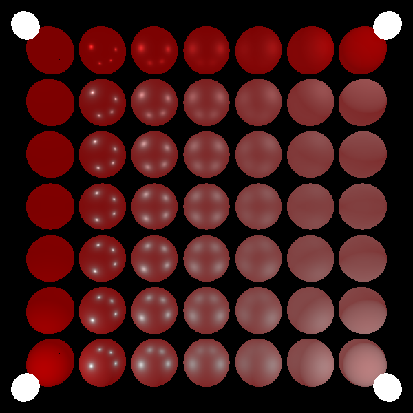

# renderling 🍖

This aspires to be a modern "GPU-driven" renderer. It is alpha software. I'm still learning, but quickly!

`renderling` holds entire scenes of geometry, textures, materials and lighting in GPU buffers.
Most of the rendering operations happen on the GPU.
The CPU is used to interact with the filesystem to marshall data to the GPU and to bind buffers.
This makes `renderling` very effective at rendering certain types of scenes.
Specifically `renderling` aims to be good at rendering scenes with a moderate level of geometry,
with a moderate number of textures (or small textures) and lots of lighting effects.




## API Features

* builder pattern for scenes, entities (scene nodes), materials and lights
* headless rendering support
  - rendering to texture and saving via `image` crate
* text rendering support (cargo feature `text` - on by default)
* nested nodes with local transforms
* tight support for loading scenes through `gltf` (cargo feature `gltf` - on by default)

Shaders are written in Rust via `rust-gpu` where possible, falling back to `wgsl` where needed.

## Rendering Features / Roadmap

Renderling takes a [forward+](https://takahiroharada.files.wordpress.com/2015/04/forward_plus.pdf) approach to rendering.

By default it uses a single uber-shader with a configurable lighting model per material.

This means each model may be shaded separately, with a different lighting style.

- [ ] frustum culling
- [ ] occlusion culling
- [ ] light tiling
- 3d
  - [x] Built-in support for common lighting/material workflows
    - [x] physically based shading
    - [x] unlit
  - [x] high dynamic range
  - [ ] skybox
  - image based lighting
    - [ ] diffuse
    - [ ] specular
  - [ ] msaa
  - [ ] bloom
  - [ ] ssao
  - [ ] depth of field
  - gltf support
    - [ ] scenes
    - [x] nodes
    - [x] cameras
    - [x] meshes
    - materials
      - [x] pbr metallic roughness (factors + textures)
      - [x] normal mapping
      - [x] occlusion textures
      - [ ] pbr specular glosiness
      - [ ] parallax mapping
    - [x] textures, images, samplers
    - animation
      - [x] interpolation
      - [ ] morph targets
      - [ ] skins
- 2d
  - [x] colored, textured vertices
  - [x] text rendering mode
  - [ ] gpu-driven 2d
    - [ ] SDF-based primitives
      - [ ] text

## Definition
**renderling** noun

A small beast that looks cute up close, ready to do your graphics bidding.

## Haiku

> Ghost in the machine,
> lighting your scene with magic.
> Cute technology.

## Project Organization
* crates/renderling-shader

  Contains Rust shader code that can be shared on CPU and GPU (using `rust-gpu` to compile to SPIR-V).
  Most of the shader code is here!
  Certain tasks require atomics which doesn't work from `rust-gpu` to `wgpu` yet. See [NOTES.md](NOTES.md).
  This crate is a member of the workspace so you get nice editor tooling while writing shaders in Rust.
  You can also write sanity tests that run with `cargo test`.
  Things just work like BAU.

* shaders

  Contains a thin crate wrapper around `renderling-shader`.
  Provides the spirv annotations for shaders.
  Contains a program that compiles Rust into SPIR-V and copies **.spv** files into the main `renderling` crate.

* crates/renderling

  The main crate.
  Contains CPU Rust code for creating pipelines and managing resources, making render passes, etc.
  Contains tests, some using image comparison of actual frame renders for consistency and backwards compatibility.

* img

  Image assets for tests (textures, etc.)

* test_img

  Reference images to use for testing.

* crates/example

  Contains an example of using the `renderling` crate to make an application.

## Tests

Tests use `renderling` in headless mode and generate images that are compared to expected output.

### Running tests

```
cargo test
```

## Building the shaders

The `shaders/` folder is a crate that is excluded from the cargo workspace.
It compiles into a program that can be run to generate the shaders:

```
cd shaders/ && cargo run --release
```

## 🫶 Sponsor this!

This work will always be free and open source. If you use it (outright or for inspiration), please consider donating.

[💰 Sponsor 💝](https://github.com/sponsors/schell)

## License
Renderling is free and open source. All code in this repository is dual-licensed under either:

    MIT License (LICENSE-MIT or http://opensource.org/licenses/MIT)
    Apache License, Version 2.0 (LICENSE-APACHE or http://www.apache.org/licenses/LICENSE-2.0)

at your option. This means you can select the license you prefer! This dual-licensing approach
is the de-facto standard in the Rust ecosystem and there are very good reasons to include both.

Unless you explicitly state otherwise, any contribution intentionally submitted for inclusion
in the work by you, as defined in the Apache-2.0 license, shall be dual licensed as above,
without any additional terms or conditions.
