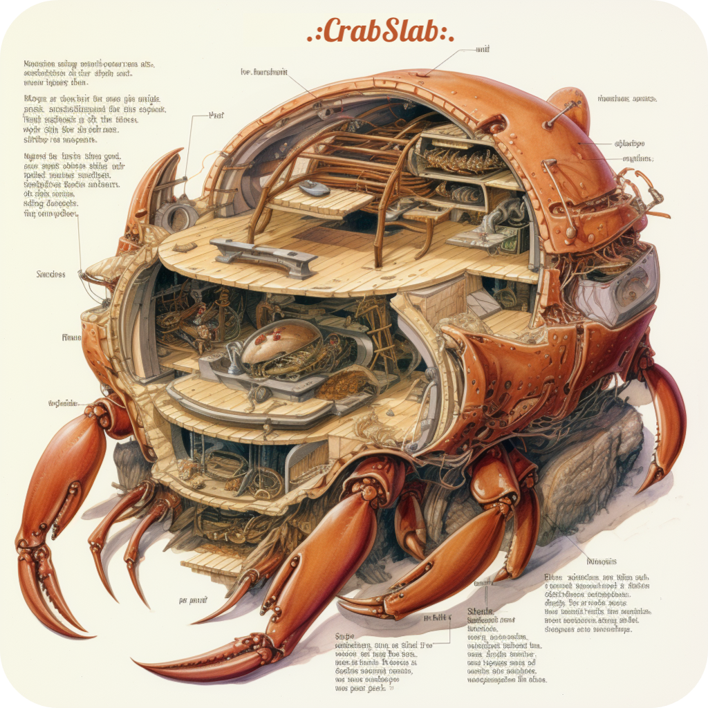

  <h1>
     
  </h1>

  <blockquote>
    Slabcraft for crabs.
  </blockquote>

## what
`crabslab` is a slab implementation focused on CPUs and GPUs.

## why
### Opinion
Working with shaders is much easier using a slab.

## how
`crabslab` includes:
* a few traits - `Slab`, `GrowableSlab` and `SlabItem`
* a derive macro for `SlabItem`
* a few structs for working with various slabs - `Id` `Array` and `Offset`
* a helper struct `CpuSlab`
* a feature-gated helper for using slabs with `wgpu` - `WgpuBuffer`
