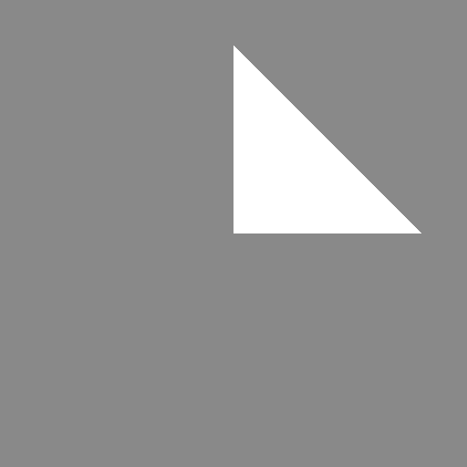
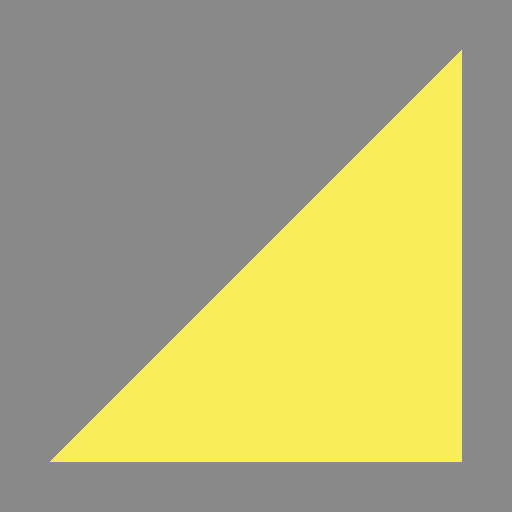

# Animation 🎬

GLTF files can carry animation data, and `renderling` can play it back. There
are three related mechanisms:

1. **Animation clips** - keyframed translations, rotations and scales for the
   nodes in a scene, played back with the [`Animator`].
2. **Morph targets** - per-vertex "shapes" blended by weight.
3. **Skins** - vertices bound to a skeleton of joint transforms.

## Playing an animation clip

We'll start with a GLTF file containing an animated triangle. As usual, load
it through the stage, then render the starting frame:

```rust,ignore
{{#include ../../crates/examples/src/animation.rs:setup}}
```

To play the document's animation, collect the scene's nodes and hand them to
the [`Animator`] along with a clip:

```rust,ignore
{{#include ../../crates/examples/src/animation.rs:animator}}
```

Then advance the animation and render. In an application this happens every
frame, with `dt` the time since the previous one:

```rust,ignore
{{#include ../../crates/examples/src/animation.rs:progress}}
```




The animation wraps around automatically once it runs past its last keyframe.

## Morph targets

Morph targets are alternative positions (and normals/tangents) for a mesh's
vertices, blended in by weight. This is how faces emote, how lips sync, and
how simple effects like this twisted quad are done:

```rust,ignore
{{#include ../../crates/examples/src/animation.rs:morph}}
```




Here we built the morph target by hand with
[`Stage::new_morph_targets`] and [`Stage::new_morph_target_weights`], attached
them with [`Primitive::set_morph_targets`], and updated the weight at
runtime. For GLTF files, the loader stages morph targets for you, and
animation clips can drive the weights automatically through the
[`Animator`].

## Skins

"Skinned" meshes have their vertices bound to a skeleton: each vertex follows
a weighted combination of "joint" transforms, so moving a joint drags the
mesh along like skin over bone. Loading a rigged GLTF file stages the skin,
and rendering with skinning is enabled with
[`Stage::set_has_vertex_skinning`] (or `with_vertex_skinning` on the stage):

```rust,ignore
stage.set_has_vertex_skinning(true);
```

> **Caveat:** vertex skinning currently produces no visible effect, even with
> the skeleton posed - see
> [issue #244](https://github.com/schell/renderling/issues/244). The manual
> will cover skinning in depth once that is fixed.

[`Animator`]: {{DOCS_URL}}/renderling/gltf/anime/struct.Animator.html
[`Stage::set_has_vertex_skinning`]: {{DOCS_URL}}/renderling/stage/struct.Stage.html#method.set_has_vertex_skinning
[`Stage::new_morph_targets`]: {{DOCS_URL}}/renderling/stage/struct.Stage.html#method.new_morph_targets
[`Stage::new_morph_target_weights`]: {{DOCS_URL}}/renderling/stage/struct.Stage.html#method.new_morph_target_weights
[`Primitive::set_morph_targets`]: {{DOCS_URL}}/renderling/primitive/struct.Primitive.html#method.set_morph_targets