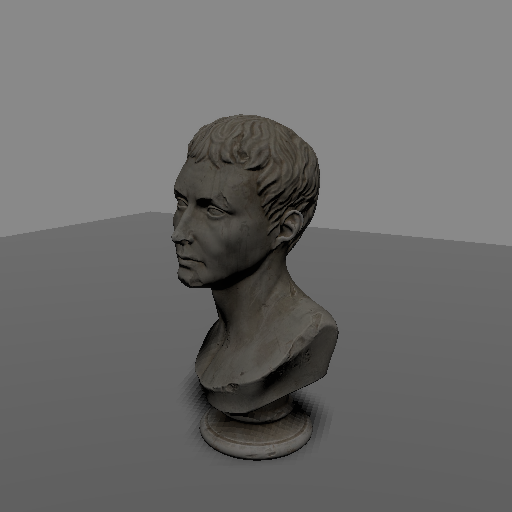
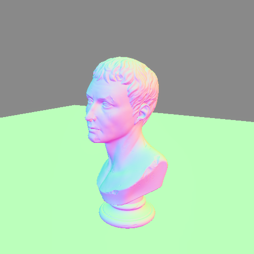
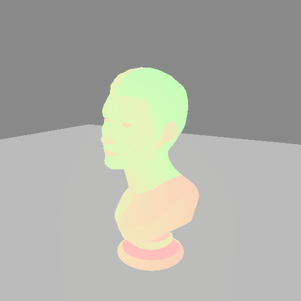
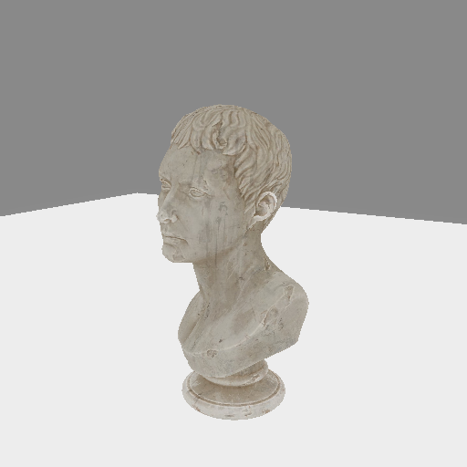

# Debug modes 🔍

When shading goes wrong - shadow acne, seams, surfaces lit from the wrong
direction - it helps to see the raw values the shader is working with.
`renderling` has two built-in debugging tools:

1. **Debug channels** - visualize an intermediate value of the fragment shader
   as colors, one channel at a time.
2. **The debug overlay** - draw the projected bounding volumes of every drawn
   primitive, useful when debugging culling. (Currently not rendering - see the
   caveat below.)

## Example setup

We'll debug the shadow mapping scene from the previous chapters:

```rust,ignore
{{#include ../../crates/examples/src/debug.rs:setup}}
```



## Debug channels

Set the stage's debug channel with [`Stage::set_debug_mode`] (or
[`Stage::with_debug_mode`] at stage creation). The scene then renders through
the given [`DebugChannel`], which early-exits the fragment shader and displays
an intermediate value as colors:

```rust,ignore
{{#include ../../crates/examples/src/debug.rs:channel}}
```







The full set of channels, grouped by what they show:

| group | channels | reach for when |
|---|---|---|
| geometry | `UvCoords0`, `UvCoords1`, `VertexColor` | texture mapping looks wrong, colors are off |
| normals | `VertexNormals`, `Normals`, `UvNormals`, `Tangents`, `Bitangents` | lighting/shadows come from the wrong direction; normal maps misbehaving |
| material | `Albedo`, `Roughness`, `Metallic`, `Occlusion` | a material parameter is not what you think it is |
| emissive | `Emissive`, `UvEmissive`, `EmissiveFactor`, `EmissiveStrength` | glowing too much or not at all |
| lighting | `DiffuseIrradiance`, `SpecularReflection`, `Brdf` | isolating what the lights and IBL actually contribute |

For example, `Normals` is the first thing to check when a shadow appears on a
surface that should be lit: a wrong normal explains most "shadows where there
shouldn't be any" bugs, including shadow-mapping acne.

Set the channel back to `DebugChannel::None` to render normally again.

## The debug overlay

[`Stage::set_use_debug_overlay`] (or `with_debug_overlay`) draws the projected
bounding volume of every drawn primitive as outlines on top of the final
image. It is meant for debugging why things draw or don't draw - for example
when frustum culling is more aggressive than expected.

> **Caveat:** the debug overlay currently produces no visible output, even on
> the GPU-driven indirect drawing path it requires - see
> [issue #243](https://github.com/schell/renderling/issues/243). It also
> silently does nothing under direct drawing, since the overlay visualizes the
> indirect draw calls.

[`DebugChannel`]: {{DOCS_URL}}/renderling/pbr/debug/enum.DebugChannel.html
[`Stage::set_debug_mode`]: {{DOCS_URL}}/renderling/stage/struct.Stage.html#method.set_debug_mode
[`Stage::with_debug_mode`]: {{DOCS_URL}}/renderling/stage/struct.Stage.html#method.with_debug_mode
[`Stage::set_use_debug_overlay`]: {{DOCS_URL}}/renderling/stage/struct.Stage.html#method.set_use_debug_overlay