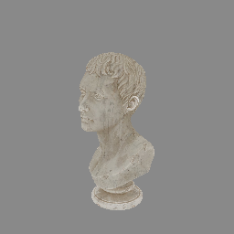

# GLTF

`renderling`'s built-in model format is [GLTF](https://www.khronos.org/gltf/), a
versatile and efficient format for transmitting 3D models. GLTF, which stands
for GL Transmission Format, is designed to be a compact, interoperable format
that can be used across various platforms and applications. It supports a wide
range of features including geometry, materials, animations, and more, making it
a popular choice for 3D graphics.

## Using GLTF files

The previous section on [staging resources](./stage) covered the creation of
various GPU resources such as [`Camera`], [`Vertices`], [`Material`],
[`Primitive`], and [`Transform`]. When you load a GLTF file into `renderling`,
it automatically stages a collection of these resources. This means that the
GLTF file is parsed, and the corresponding GPU resources are created and
returned to you, allowing you to integrate them into your application
seamlessly.

## Example

We'll start by creating our [`Context`], [`Stage`] and [`Camera`]:

```rust,ignore
{{#include ../../crates/examples/src/gltf.rs:setup}}
```

Then we load our GLTF file through the [`Stage`] with
[`Stage::load_gltf_document_from_path`], and as long as there are no errors it returns a
[`GltfDocument`]:

```rust,ignore
{{#include ../../crates/examples/src/gltf.rs:load}}
```

On WASM we would use [`Stage::load_gltf_document_from_bytes`] as the filesystem
is unavailable.

Notice how in the above example we call [`GltfDocument::into_gpu_only`] to
unload the mesh geometry from the CPU.

## Render

```rust,ignore
{{#include ../../crates/examples/src/gltf.rs:render_1}}
```

## Result


But wait! It's all in shadow.

This is because we haven't added any lighting.

We have two options here:
1. Turn of lighting and show the scene "unlit", using [`Stage::set_has_lighting`]
2. Add some lights

For now we'll go with option `1`, as lighting happens in a later section:

```rust,ignore
{{#include ../../crates/examples/src/gltf.rs:no_lights}}
```



[`Context`]: {{DOCS_URL}}/renderling/context/struct.Context.html
[`Stage`]: {{DOCS_URL}}/renderling/stage/struct.Stage.html
[`Stage::load_gltf_document_from_bytes`]: {{DOCS_URL}}/renderling/stage/struct.Stage.html#method.load_gltf_document_from_bytes
[`Stage::load_gltf_document_from_path`]: {{DOCS_URL}}/renderling/stage/struct.Stage.html#method.load_gltf_document_from_path
[`Stage::set_has_lighting`]: {{DOCS_URL}}/renderling/stage/struct.Stage.html#method.set_has_lighting
[`GltfDocument`]: {{DOCS_URL}}/renderling/gltf/struct.GltfDocument.html
[`GltfDocument::into_gpu_only`]: {{DOCS_URL}}/renderling/gltf/struct.GltfDocument.html#method.into_gpu_only
[`Camera`]: {{DOCS_URL}}/renderling/camera/struct.Camera.html
[`Material`]: {{DOCS_URL}}/renderling/material/struct.Material.html
[`Primitive`]: {{DOCS_URL}}/renderling/primitive/struct.Primitive.html
[`Vertices`]: {{DOCS_URL}}/renderling/geometry/struct.Vertices.html
[`Transform`]: {{DOCS_URL}}/renderling/transform/struct.Transform.html
