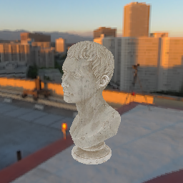

# Lighting 💡

Lighting in `renderling` comes in a few flavors:

1. **Unlit** - no lighting at all
2. **Analytical lights** - specific lights created by the programmer
    * directional 
    * point
    * spot
3. **Image based lighting** - lighting by 3d environment maps


## Scene recap

We've already used the "unlit" method of turning off all lighting on the stage.

Let's do a quick recap of our scene, starting where we left off with the skybox
example.

We created our context, and then our stage, and it's important to note that we
used `.with_lighting(false)` on the stage, which tells the stage not to use any
lighting.
This is the "unlit" lighting method mentioned above.

Then we created a camera and loaded a GLTF file of a marble bust, then loaded an
HDR image into a skybox, and then rendered:

```rust,ignore
{{#include ../../crates/examples/src/lighting.rs:setup}}
```



Now let's learn about analytical lights, and then image based lighting.
