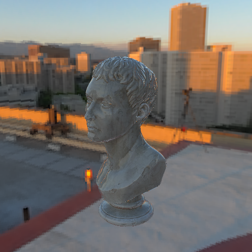

# Image based lighting 🌐

Image-based lighting (IBL) is a technique that uses environment maps to
illuminate scenes. It captures real-world lighting conditions and applies them
to 3D models, providing realistic reflections and ambient lighting. IBL is
particularly effective for creating natural-looking scenes by simulating complex
lighting scenarios that are difficult to achieve with traditional analytical lights alone.

## Example setup

We'll start from where we left off with the skybox example (before adding
analytical lights):

```rust,ignore
{{#include ../../../crates/examples/src/lighting.rs:ibl_setup}}
```

Now we'll add image based lighting.

## The `Ibl` type

[`Ibl`] is the type responsible for image based lighting.
You can think of it as a type of "global" light.
More than one [`Ibl`] may exist, but only one can be used
by the stage at render time.

Creating an [`Ibl`] follows the same expected builder pattern,
and just like [`Skybox`] we call a familiar `use_*` function
on the [`Stage`] to use it:

```rust,ignore
{{#include ../../../crates/examples/src/lighting.rs:ibl}}
```



## Mix it up! 🎨

You can mix global image based lighting with analytical lights, just as you
might expect. Here we'll build on the previous example to add a point light:

```rust,ignore
{{#include ../../../crates/examples/src/lighting.rs:mix}}
```


By combining IBL with analytical lights, you can achieve a rich and dynamic
lighting environment that captures both the subtle nuances of ambient light and
the dramatic effects of direct illumination.
Experiment with different environment maps and light setups to find the perfect
balance for your scene.

[`Ibl`]: {{DOCS_URL}}/renderling/pbr/ibl/struct.Ibl.html
[`Skybox`]: {{DOCS_URL}}/renderling/skybox/struct.Skybox.html
[`Stage`]: {{DOCS_URL}}/renderling/stage/struct.Stage.html
