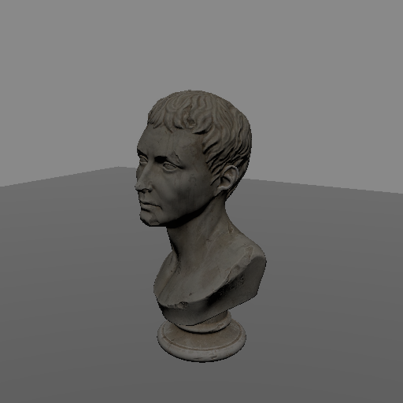

# Shadow mapping 🌑

Shadow mapping is the technique used to render shadows cast by lights.

It works by rendering the scene one more time, but from the point of view of
the light. Instead of colors, this rendering stores the _depth_ of each
fragment - how far away the closest surface is. Then, when the scene is shaded
for the camera, each fragment can compare its own depth from the light's
perspective to the stored depth. If the fragment is farther away, something is
in front of it, and the fragment is in shadow.

In `renderling` shadow maps are rendered into textures stored in a shared
"shadow map atlas". The size of the atlas can be configured with
[`Context::with_shadow_mapping_atlas_texture_size`].

## Example setup

We'll continue with our marble bust scene, but this time we'll add a ground
plane for the bust's shadow to land on, and a directional light to cast it:

```rust,ignore
{{#include ../../../crates/examples/src/shadow.rs:setup}}
```

## Without shadows

Rendering the scene now gives us a well-lit bust, but no shadow:

```rust,ignore
{{#include ../../../crates/examples/src/shadow.rs:render_without_shadow}}
```



Notice how the ground is just as bright beneath the bust as it is everywhere
else. The bust does not block the light at all.

## Creating a shadow map

To cast shadows, we create a [`ShadowMap`] for our light using
[`Stage::new_shadow_map`]:

```rust,ignore
{{#include ../../../crates/examples/src/shadow.rs:shadowmap}}
```

The `size` argument determines the resolution of the shadow map - bigger maps
give crisper shadows but use more memory. The `z_near` and `z_far` arguments
bound the light's frustum - only objects within the frustum will cast shadows.

## Updating the shadow map

A shadow map is a rendering of the scene, which means it has to be kept up to
date. Updating is done with [`ShadowMap::update`], which takes the primitives
to render as shadow casters:

```rust,ignore
{{#include ../../../crates/examples/src/shadow.rs:update}}
```

In a typical application you will call [`ShadowMap::update`] every frame,
before [`Stage::render`].

The [`ShadowMap`] holds a weak reference to the light it was created with, so
changes made to the light - like moving the sun across the sky - automatically
propagate to the shadow map on the next update.


And just like that, our bust casts a shadow!

## Tuning

Shadow maps have limited precision, which shows up as visual artifacts. The
two most common are "shadow acne", where surfaces end up shadowing themselves,
and "peter panning", where shadows detach from their casters. Both are
controlled with the bias values on the shadow map's descriptor:

```rust,ignore
{{#include ../../../crates/examples/src/shadow.rs:tuning}}
```

Increasing the bias values lifts surfaces out of their own shadow, fixing
acne. Too much bias, though, and shadows start to detach from the objects
casting them.

The `pcf_samples` field controls the softness of the shadow edges through
"percentage-closer filtering". Higher values produce softer edges but cost
more texture samples.

## Tips for making a good shadow map

1. **Make sure the map is big enough.** A bigger map gives cleaner shadows,
   and can fix some peter panning issues even before playing with bias.
2. **Don't set `pcf_samples` too high.** A high sample count can actually
   _cause_ peter panning, and costs more.
3. **Ensure `z_near` and `z_far` make sense for your scene.** If you find that
   shadows are cut off in a straight line, it's likely one of them needs
   adjustment.
4. **Expect point lights to be more expensive.** A point light shadow map
   renders the scene from six points of view, one for each face of a cube
   around the light. To compensate for the lower per-face resolution, the
   number of percentage-closer filtering samples is forced to 16 for point
   lights.

[`Context::with_shadow_mapping_atlas_texture_size`]: {{DOCS_URL}}/renderling/context/struct.Context.html#method.with_shadow_mapping_atlas_texture_size
[`ShadowMap`]: {{DOCS_URL}}/renderling/light/struct.ShadowMap.html
[`ShadowMap::update`]: {{DOCS_URL}}/renderling/light/struct.ShadowMap.html#method.update
[`Stage::new_shadow_map`]: {{DOCS_URL}}/renderling/stage/struct.Stage.html#method.new_shadow_map
[`Stage::render`]: {{DOCS_URL}}/renderling/stage/struct.Stage.html#method.render