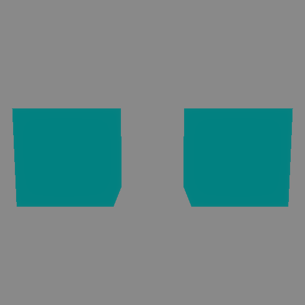
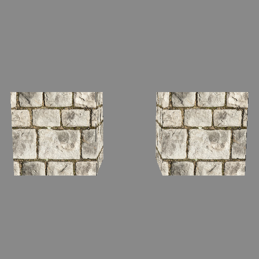
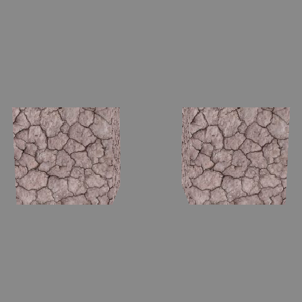
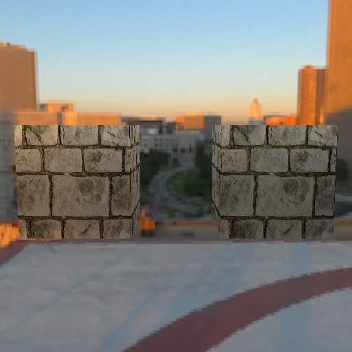
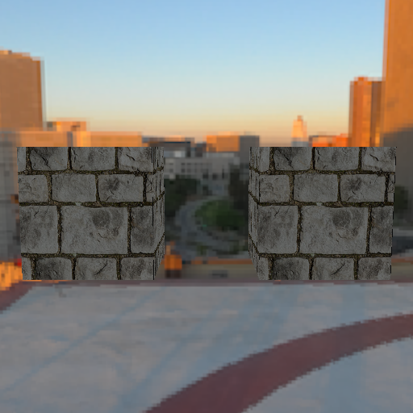
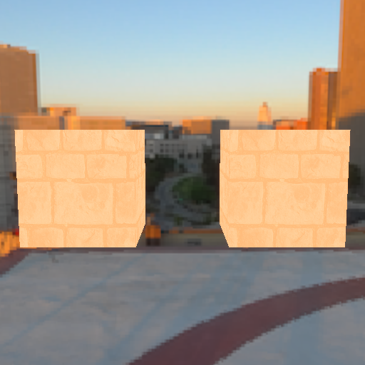
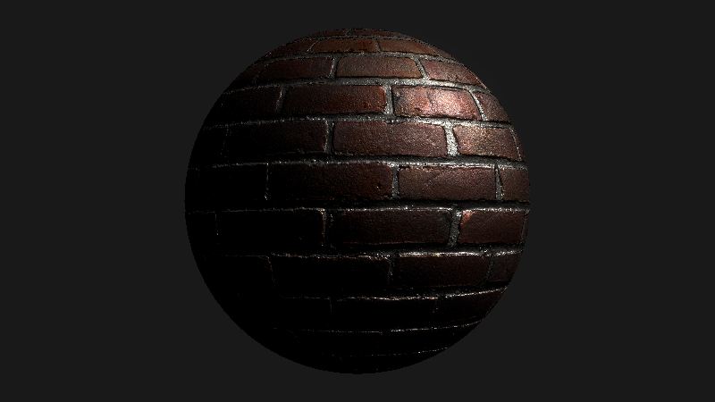

# Materials and textures 🎨

Materials describe how a surface looks and how it responds to light: its base
color, how metallic and rough it is, whether it glows on its own, and which
textures to sample for all of the above.

We met [`Material`] briefly in [the staging chapter](/stage.html) - now let's
give it a proper tour.

## Example setup

We'll use two cubes that share the same vertices, each with its own transform.
Materials can be shared by any number of primitives, and by the end of this
chapter you'll see why that's useful:

```rust,ignore
{{#include ../../crates/examples/src/material.rs:setup}}
```

## The albedo factor

The simplest material parameter is the "albedo factor" - the base color of the
surface. Here we create an unlit material (lighting turned off on the material
itself) with a teal albedo factor, and assign it to both cubes:

```rust,ignore
{{#include ../../crates/examples/src/material.rs:albedo_factor}}
```



Note that one material instance covers both cubes. Materials are staged
resources - assigning the same [`Material`] to many primitives costs nothing
extra, and any later change to the material updates every primitive using it.

## Textures and the atlas

Flat colors only get you so far. To use image textures, first stage them in
the stage's texture atlas with [`Stage::set_images`], which takes
[`AtlasImage`]s and returns one [`AtlasTexture`] handle per image:

```rust,ignore
{{#include ../../crates/examples/src/material.rs:albedo_texture}}
```

Two things to know about `set_images`:

1. It **resets the atlas**, repacking it with just the images given. Any
   [`AtlasTexture`] handles from a previous call are invalidated.
2. Because of that, stage all the images you'll need up front, in one call.

## Using a texture

With handles in hand, we can set the albedo texture of our material:

```rust,ignore
{{#include ../../crates/examples/src/material.rs:use_texture}}
```



The albedo factor _multiplies_ the albedo texture, which is why we reset it to
white first. Multiplying by a non-white factor is a cheap way to tint a
texture.

## Updating materials at runtime

Materials are staged, so updates are cheap and automatic. One call to
[`Material::set_albedo_texture`] switches _both_ cubes to the second image:

```rust,ignore
{{#include ../../crates/examples/src/material.rs:update}}
```



## PBR parameters

So far our material has been unlit. With lighting on, materials become
"physically based" (PBR), with a few more knobs:

* `metallic_factor` - how metal-like the surface is. Metals tint their
  reflections with the albedo color.
* `roughness_factor` - how rough the surface is. Rough surfaces blur
  reflections.

For this demo we'll also give the scene a skybox, image-based lighting and a
sun, so the metallic surface has an environment to reflect. Those are covered
in [the skybox](/skybox.html) and [lighting](/lighting.html) chapters:

```rust,ignore
{{#include ../../crates/examples/src/material.rs:pbr}}
```



Crank the roughness up and the reflections smear into a matte surface:

```rust,ignore
{{#include ../../crates/examples/src/material.rs:roughness}}
```



## Emissive color

Emissive color is added directly to the final color, regardless of lighting,
and takes an optional strength multiplier. Combined with bloom, emissive
materials glow:

```rust,ignore
{{#include ../../crates/examples/src/material.rs:emissive}}
```



## Normal maps

Normal maps fake small-scale surface detail by perturbing the surface normal
per-pixel, which changes how light interacts with the surface without adding
any geometry.

GLTF files can carry normal maps, and the loader wires them into the material
for you. This brick sphere has lighting and a normal map baked in:

```rust,ignore
{{#include ../../crates/examples/src/material.rs:normal_map}}
```



When building materials by hand, the same slots exist as builders:
[`Material::with_normal_texture`],
[`Material::with_metallic_roughness_texture`],
[`Material::with_ambient_occlusion_texture`] and
[`Material::with_emissive_texture`], along with their `set_*` counterparts.
Each texture slot can also pick which UV set of the vertex to sample with
(`with_albedo_tex_coord` and friends) when a mesh carries more than one.

[`Material`]: {{DOCS_URL}}/renderling/material/struct.Material.html
[`Material::set_albedo_texture`]: {{DOCS_URL}}/renderling/material/struct.Material.html#method.set_albedo_texture
[`Material::with_normal_texture`]: {{DOCS_URL}}/renderling/material/struct.Material.html#method.with_normal_texture
[`Material::with_metallic_roughness_texture`]: {{DOCS_URL}}/renderling/material/struct.Material.html#method.with_metallic_roughness_texture
[`Material::with_ambient_occlusion_texture`]: {{DOCS_URL}}/renderling/material/struct.Material.html#method.with_ambient_occlusion_texture
[`Material::with_emissive_texture`]: {{DOCS_URL}}/renderling/material/struct.Material.html#method.with_emissive_texture
[`Stage::set_images`]: {{DOCS_URL}}/renderling/stage/struct.Stage.html#method.set_images
[`AtlasImage`]: {{DOCS_URL}}/renderling/atlas/struct.AtlasImage.html
[`AtlasTexture`]: {{DOCS_URL}}/renderling/atlas/struct.AtlasTexture.html