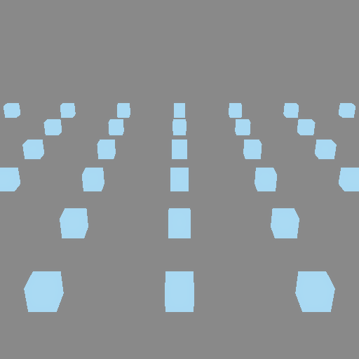
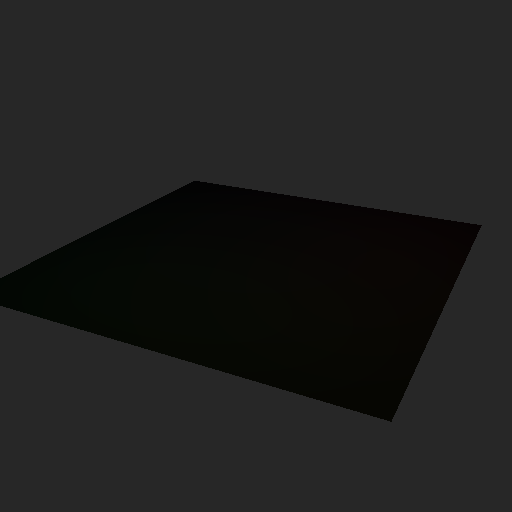
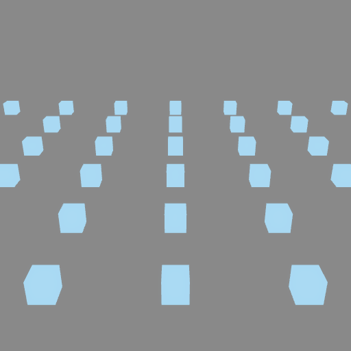

# Performance ⚡

`renderling` is a GPU-driven renderer: several features move work from your
code (and from wasted GPU work) into efficient pre-passes. None of them change
the picture - they change how much work it takes to produce it.

## Frustum culling

Objects outside the camera's view cannot be seen, so there is no reason to
draw them. Frustum culling skips them in a GPU step before drawing, and **is
on by default**:

```rust,ignore
{{#include ../../crates/examples/src/performance.rs:culling}}
```



The example renders a grid of cubes with culling on and off - the two
renderings are byte-for-byte identical. That is the whole point: culling
skips invisible work without changing the output. Turn it off only for
debugging:

```rust,ignore
stage.set_use_frustum_culling(false);
```

## Occlusion culling

Occlusion culling goes further and skips objects that are *hidden behind*
other objects. It is **off by default**, and is still a feature in
development:

```rust,ignore
{{#include ../../crates/examples/src/performance.rs:occlusion}}
```

## Light tiling

Analytical lights are how scenes get their shine, but a naive renderer makes
every fragment consider *every* light. With a grid of point lights the cost
adds up fast:

```rust,ignore
{{#include ../../crates/examples/src/performance.rs:many_lights}}
```



Light tiling bins lights into screen-space tiles, so each fragment only
considers the lights that overlap its tile. Create it with
[`Stage::new_light_tiling`] and run it before rendering - in an application,
every frame:

```rust,ignore
{{#include ../../crates/examples/src/performance.rs:tiling}}
```


The two images above are identical - tiling is pure savings. The
[`LightTilingConfig`] has three knobs:

* `tile_size` - the size of each screen tile, in pixels. Defaults to `16`.
* `max_lights_per_tile` - the maximum number of lights binned per tile.
  Defaults to `32`.
* `minimum_illuminance` - lights dimmer than this, in lux, are skipped.
  Defaults to `0.1`. (For reference: moonlight is under 1 lux, indoor
  lighting runs 100-300, detailed work needs 1000 or more.)

## MSAA

Multisample anti-aliasing smooths the jagged edges of geometry by taking
multiple samples per pixel. Set the sample count on the stage - `4` is a good
default:

```rust,ignore
{{#include ../../crates/examples/src/performance.rs:msaa}}
```



[`Stage::set_use_frustum_culling`]: {{DOCS_URL}}/renderling/stage/struct.Stage.html#method.set_use_frustum_culling
[`Stage::set_use_occlusion_culling`]: {{DOCS_URL}}/renderling/stage/struct.Stage.html#method.set_use_occlusion_culling
[`Stage::new_light_tiling`]: {{DOCS_URL}}/renderling/stage/struct.Stage.html#method.new_light_tiling
[`LightTilingConfig`]: {{DOCS_URL}}/renderling/light/struct.LightTilingConfig.html
[`Stage::set_msaa_sample_count`]: {{DOCS_URL}}/renderling/stage/struct.Stage.html#method.set_msaa_sample_count