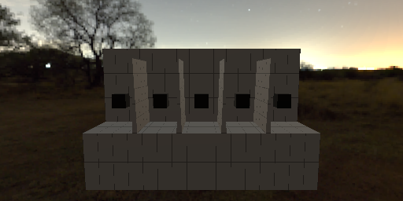
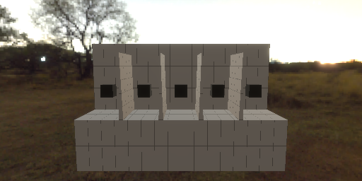
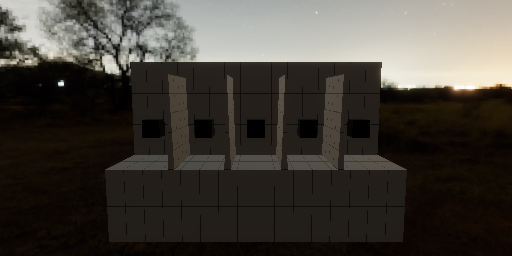

# Post-processing ✨

`renderling` renders scenes in **high dynamic range** (HDR), where colors can be
far brighter than a display can show. After the scene is rendered, two
post-processing passes turn that HDR image into the final picture:

1. **Bloom** - bright areas glow, by mixing a blurred copy of the bright parts
   back into the image.
2. **Tonemapping** - HDR values are mapped into the range the display can
   show, using an exposure value and a tone mapping algorithm.

## Example setup

We'll use a night sky and a model full of glowing emissive objects, so there
are bright areas for the effects to work on. Note that bloom is on by default -
we turn it off here so we can show the difference:

```rust,ignore
{{#include ../../crates/examples/src/postprocessing.rs:setup}}
```



## Bloom

Bloom can be toggled at stage creation with [`Stage::with_bloom`], or at
runtime with [`Stage::set_has_bloom`]. Two parameters control the look:

* [`Stage::set_bloom_mix_strength`] - how much of the blurred bright areas to
  mix back into the image. Defaults to `0.04`.
* [`Stage::set_bloom_filter_radius`] - the radius of the blur, in texels.

```rust,ignore
{{#include ../../crates/examples/src/postprocessing.rs:bloom}}
```


## Tonemapping

Before the image is shown, it is multiplied by the **exposure** and passed
through the **tone mapping algorithm**, which compresses HDR values into the
display's range.

The current configuration is available through the stage's
[`Tonemapping`] as a [`TonemapConstants`] - a small struct with two fields:

```rust,ignore
{{#include ../../crates/examples/src/postprocessing.rs:exposure}}
```



By default no tone mapping algorithm is used (`Tonemap::NONE`) - HDR values
outside the display range simply clip to white. The available algorithms are:

* [`Tonemap::NONE`] - no tone mapping, values clip (default)
* [`Tonemap::ACES_NARKOWICZ`] - the popular ACES approximation
* [`Tonemap::ACES_HILL`] - the ACES fit by Stephen Hill
* [`Tonemap::ACES_HILL_EXPOSURE_BOOST`] - `ACES_HILL` with a built-in
  exposure boost, the "filmic" look popularized by three.js
* [`Tonemap::REINHARD`] - the simple Reinhard operator

```rust,ignore
{{#include ../../crates/examples/src/postprocessing.rs:tonemap}}
```



Filmic operators like ACES trade a little saturation for smoother highlights -
notice how the bright objects keep more of their color, instead of blowing out
to white.

[`Stage::with_bloom`]: {{DOCS_URL}}/renderling/stage/struct.Stage.html#method.with_bloom
[`Stage::set_has_bloom`]: {{DOCS_URL}}/renderling/stage/struct.Stage.html#method.set_has_bloom
[`Stage::set_bloom_mix_strength`]: {{DOCS_URL}}/renderling/stage/struct.Stage.html#method.set_bloom_mix_strength
[`Stage::set_bloom_filter_radius`]: {{DOCS_URL}}/renderling/stage/struct.Stage.html#method.set_bloom_filter_radius
[`Tonemapping`]: {{DOCS_URL}}/renderling/tonemapping/struct.Tonemapping.html
[`Tonemapping::set_tonemapping_config`]: {{DOCS_URL}}/renderling/tonemapping/struct.Tonemapping.html#method.set_tonemapping_config
[`TonemapConstants`]: {{DOCS_URL}}/renderling/tonemapping/struct.TonemapConstants.html
[`Tonemap`]: {{DOCS_URL}}/renderling/tonemapping/struct.Tonemap.html
[`Tonemap::NONE`]: {{DOCS_URL}}/renderling/tonemapping/struct.Tonemap.html#associatedconstant.NONE
[`Tonemap::ACES_NARKOWICZ`]: {{DOCS_URL}}/renderling/tonemapping/struct.Tonemap.html#associatedconstant.ACES_NARKOWICZ
[`Tonemap::ACES_HILL`]: {{DOCS_URL}}/renderling/tonemapping/struct.Tonemap.html#associatedconstant.ACES_HILL
[`Tonemap::ACES_HILL_EXPOSURE_BOOST`]: {{DOCS_URL}}/renderling/tonemapping/struct.Tonemap.html#associatedconstant.ACES_HILL_EXPOSURE_BOOST
[`Tonemap::REINHARD`]: {{DOCS_URL}}/renderling/tonemapping/struct.Tonemap.html#associatedconstant.REINHARD