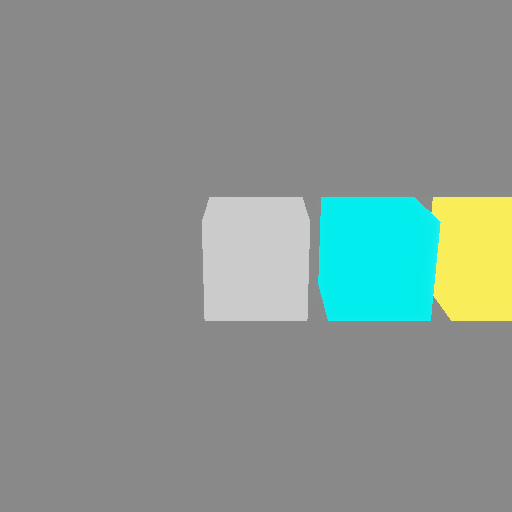
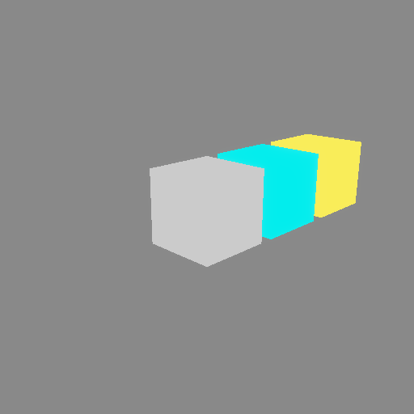
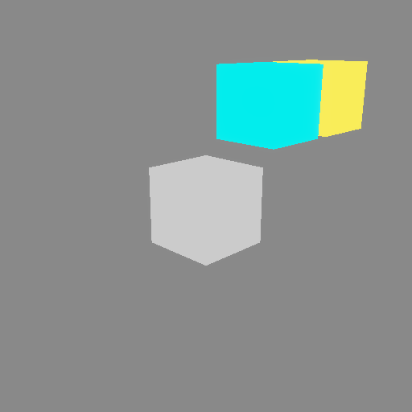

# Scene hierarchy 🌳

When objects must move together - wheels on a car, segments of a robot arm,
planets around a sun - you want a **hierarchy**: change the parent, and the
children come along for the ride.

In `renderling` that is the [`NestedTransform`]. Each node has a **local**
transform, relative to its parent. The node's **global** transform is the
composition of every local transform up the chain, and it is recalculated
automatically whenever anything in the chain changes.

## Building a hierarchy

Create nodes with [`Stage::new_nested_transform`], position them with their
`local_*` builder methods, and link them with
[`NestedTransform::add_child`]. Then attach primitives with
[`Primitive::with_transform`], handing the node a reference:

```rust,ignore
{{#include ../../crates/examples/src/scene.rs:setup}}
```



Note the cubes are all attached to *nodes*, not positioned directly. The cyan
cube sits at `root * child`, and the yellow one at `root * child * grandchild`.

## Moving the parent moves the subtree

Because children are positioned relative to their parent, changing the parent
moves everything below it:

```rust,ignore
{{#include ../../crates/examples/src/scene.rs:parent}}
```



One rotation of the root carried the entire chain.

## Moving a child moves only its subtree

Change a node's local transform, and its parent stays put:

```rust,ignore
{{#include ../../crates/examples/src/scene.rs:child}}
```



## Notes

- **Local vs global:** the `local_*` getters and setters work in the parent's
  space. To inspect the composed result, use
  [`NestedTransform::global_descriptor`], or walk the whole chain with
  [`NestedTransform::hierarchy`].
- **Updates are immediate:** changing a local transform (or the graph itself)
  recomputes the globals of the whole subtree right away, and the new globals
  sync to the GPU on the next render.
- **Detaching:** [`NestedTransform::remove_child`] unlinks a node, which then
  keeps its own transform; [`NestedTransform::parent`] returns the parent, if
  any.
- **Standalone objects** that never need to follow anything can use the
  simpler [`Transform`] from [`Stage::new_transform`] instead - that is what
  the earlier chapters used.

[`NestedTransform`]: {{DOCS_URL}}/renderling/transform/struct.NestedTransform.html
[`NestedTransform::add_child`]: {{DOCS_URL}}/renderling/transform/struct.NestedTransform.html#method.add_child
[`NestedTransform::remove_child`]: {{DOCS_URL}}/renderling/transform/struct.NestedTransform.html#method.remove_child
[`NestedTransform::parent`]: {{DOCS_URL}}/renderling/transform/struct.NestedTransform.html#method.parent
[`NestedTransform::global_descriptor`]: {{DOCS_URL}}/renderling/transform/struct.NestedTransform.html#method.global_descriptor
[`NestedTransform::hierarchy`]: {{DOCS_URL}}/renderling/transform/struct.NestedTransform.html#method.hierarchy
[`Primitive::with_transform`]: {{DOCS_URL}}/renderling/primitive/struct.Primitive.html#method.with_transform
[`Stage::new_nested_transform`]: {{DOCS_URL}}/renderling/stage/struct.Stage.html#method.new_nested_transform
[`Stage::new_transform`]: {{DOCS_URL}}/renderling/stage/struct.Stage.html#method.new_transform
[`Transform`]: {{DOCS_URL}}/renderling/transform/struct.Transform.html