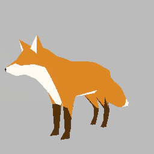
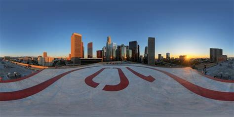
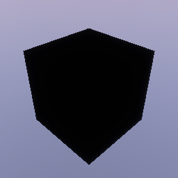

# Rendering a skybox 🌌

One of the most striking effects we can provide is a
[skybox](https://en.wikipedia.org/wiki/Skybox_(video_games)).

Using a skybox is an easy way to improve immersion, and with
`renderling` your skyboxes can also illuminate the scene, but
we'll save that for a later example. For now let's set up
simple skybox for our marble bust scene.

## Building on the stage example 

We'll start out this example by extending the example from the
[loading GLTF files](./gltf) section. In that example we loaded
a model of an old marble bust:

```rust,ignore
{{#include ../../crates/examples/src/skybox.rs:setup}}
```



## Adding the skybox

In `renderling`, skyboxes get their background from an "HDR" image.
These are typically large three dimensional images. You can find
free HDR images [at PolyHaven](https://polyhaven.com/hdris) and other
places around the web. 

For this example we'll be using this HDR:



```rust,ignore
{{#include ../../crates/examples/src/skybox.rs:skybox}}
```

Then we render:

```rust,ignore
{{#include ../../crates/examples/src/skybox.rs:render_skybox}}
```


## Results

And there we go!


