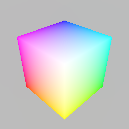

# Stage

The [`Stage`] is the most important type in `renderling`.
It's responsible for staging all your scene's data on the GPU, as well as
linking all the various effects together and rendering it all.

<!--toc:start-->
- [Stage](#stage)
  - [Stage creation](#stage-creation)
  - [Resource creation](#resource-creation)
    - [Camera](#camera)
      - [glam and re-exports](#glam-and-re-exports)
      - [Creation](#creation)
    - [Geometry](#geometry)
    - [Material](#material)
    - [Primitive](#primitive)
  - [Rendering](#rendering)
  - [Results](#results)
<!--toc:end-->

## Stage creation 

The `Stage` is created with [`Context::new_stage`].

```rust,ignore
{{#include ../../crates/examples/src/stage.rs:creation}}
```

Notice that context creation is _asynchronous_. Most of the `renderling` API is
synchronous, but context creation is one of two exceptions - the other being
reading data back from the GPU.

Also note that we can set the background color of the stage using a `Vec4`.
Above we've set the background to a light gray.

## Resource creation

Now we'll begin using the `Stage` to create our scene's resources. At the end of
all our staging we should end up with a [`Camera`] and one simple
[`Primitive`] representing a colored unit cube, sitting right in
front of the camera.

### Camera

In order to see our scene we need a [`Camera`].

The camera controls the way our scene looks when rendered. It uses separate projection and view
matrices to that end. Discussing these matrices is out of scope for this manual, but there are
plenty of resources online about what they are and how to use them.

#### glam and re-exports

One important detail about these matrices, though, is that they come from the [`glam`][glam]
library. Specifically they are [`Mat4`][Mat4], which are a 4x4 transformation matrix.

#### Creation

On with our camera. Creation is dead simple using [`Stage::new_camera`].

```rust,ignore
{{#include ../../crates/examples/src/stage.rs:camera}}
```

Each resource returned by the many `Stage::new_*` functions return resources that adhere
to the [builder pattern][builder]. That means the value a `Stage::new_*` function returns
can be chained with other calls that configure it. This pattern is nice because it
allows your editor to display the customizations available, which makes API discovery
easier for everyone.

Above we use [`Camera::with_default_perspective`] to
set the camera to use a default perspective projection.

Note that usually when we create a `Camera`, we have to tell
the `Stage` that we want to **use** the camera, but the first `Camera` created will
automatically be used. We could potentially have _many_ cameras and switch them around at will
by calling `Stage::use_camera` before rendering.

### Geometry

The first step to creating a [`Primitive`] is staging some vertices in a triangle
mesh. For this example we'll use the triangle mesh of the unit cube. The
[`renderling::math`][math] module provides a convenience function for generating this mesh.

```rust,ignore
{{#include ../../crates/examples/src/stage.rs:unit_cube_vertices}}
```

Here we create [`Vertices`], which stages the unit cube points on the GPU.

Next we'll unload those points from the CPU, to free up the memory:

```rust,ignore
{{#include ../../crates/examples/src/stage.rs:unload_vertices}}
```

Unloading the CPU memory like this isn't strictly necessary, but it's beneficial to
know about. If we were planning on inspecting or modifying the underlying
[`Vertex`] values with [`Vertices::get_vertex`] and
[`Vertices::modify_vertex`], we could skip this step.
After unloading, however, we can still set a [`Vertex`] at a specific
index using [`Vertices::set_vertex`].

### Material

Next we stage a [`Material`].

Materials denote how a mesh looks by specifying various colors and shading values,
as well as whether or not the material is lit by our lighting, which we'll talk about
in later chapters. For now we'll provide a material that doesn't really do anything
except let the vertex colors show through.

```rust,ignore
{{#include ../../crates/examples/src/stage.rs:material}}
```

### Primitive

Now that we have some [`Vertices`] and a [`Material`] we can create our primitive
using the familiar builder pattern.

```rust,ignore
{{#include ../../crates/examples/src/stage.rs:prim}}
```

We don't actually do anything with the primitive at this point though.

## Rendering

Now the scene is set and we're ready to render.

Rendering is a three-step process:

1. Get the next frame
2. Render the staged scene into the view of the frame
3. Present the frame

```rust,ignore
{{#include ../../crates/examples/src/stage.rs:render}}
```

Above we added an extra step where we read an image of the frame from the GPU,
so we can see it here.

## Results



And there you have it! We've rendered a nice cube.

## Removing resources

To remove resources from the stage we can usually just `Drop` them from all
scopes. There are a few types that require extra work to remove, though.

[`Primitive`]s must be manually removed with [`Stage::remove_primitive`],
which removes the primitive from all internal lists (like the list of draw calls).

Lights must also be removed from the stage for similar reasons.

Now we'll run through removing the cube primitive, but first let's see how many
bytes we've committed to the GPU through the stage:

```rust,ignore
{{#include ../../crates/examples/src/stage.rs:committed_size_bytes}}
```

As of this writing, these lines print out `8296`, or roughly 8k bytes.
That may seem like a lot for one cube, but keep in mind that is a count of
all bytes in all buffers, including any internal machinery.

Now let's remove the cube primitive, drop the other resources, and render again:

```rust,ignore
{{#include ../../crates/examples/src/stage.rs:removal}}
```

[`Stage`]: {{DOCS_URL}}/renderling/stage/struct.Stage.html
[`Stage::new_camera`]: {{DOCS_URL}}/renderling/stage/struct.Stage.html#method.new_camera
[`Context::new_stage`]: {{DOCS_URL}}/renderling/context/struct.Context.html#method.new_stage
[`Primitive`]: {{DOCS_URL}}/renderling/primitive/struct.Primitive.html
[`Camera`]: {{DOCS_URL}}/renderling/camera/struct.Camera.html
[`Camera::with_default_perspective`]: {{DOCS_URL}}/renderling/camera/struct.Camera.html#method.with_default_perspective
[`Vertices`]: {{DOCS_URL}}/renderling/geometry/struct.Vertices.html
[`Vertices::get_vertex`]: {{DOCS_URL}}/renderling/geometry/struct.Vertices.html#method.get_vertex
[`Vertices::modify_vertex`]: {{DOCS_URL}}/renderling/geometry/struct.Vertices.html#method.modify_vertex
[`Vertices::set_vertex`]: {{DOCS_URL}}/renderling/geometry/struct.Vertices.html#method.set_vertex
[`Vertex`]: {{DOCS_URL}}/renderling/geometry/struct.Vertex.html
[`Material`]: {{DOCS_URL}}/renderling/material/struct.Material.html

[math]: {{DOCS_URL}}/renderling/math/index.html

[Mat4]: https://docs.rs/glam/latest/glam/f32/struct.Mat4.html

[glam]: https://crates.io/crates/glam

[builder]: https://rust-unofficial.github.io/patterns/patterns/creational/builder.html
